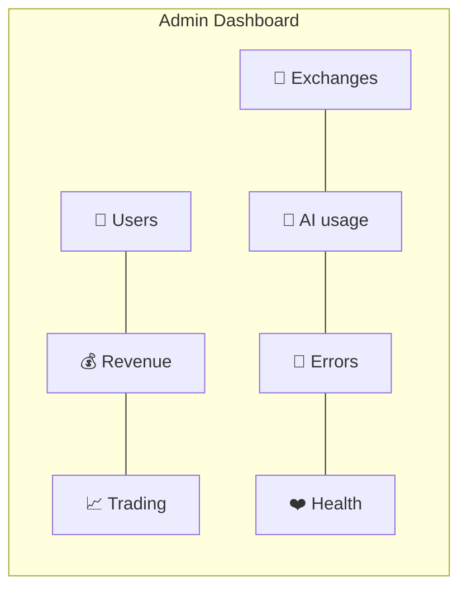
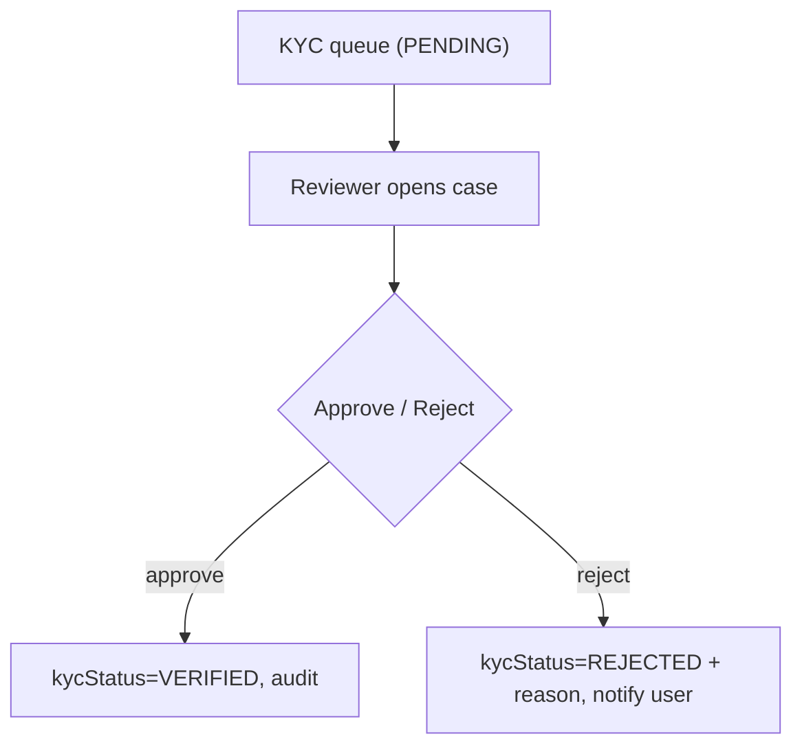
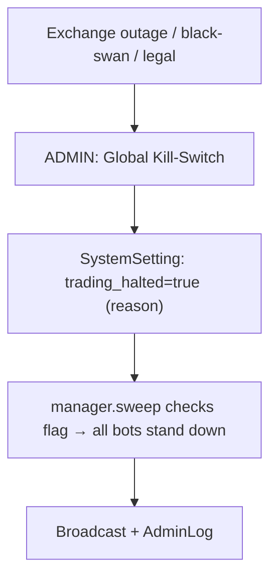

# 🛡️ ADMIN PORTAL — MASTER PLAN

**The operator/staff control center: metrics, user management, trading oversight, compliance, safety.**

> **Doc set:** [Trading agent](./FINAL_TRADING_AGENT_MASTER_PLAN.md) · [Product](./PRODUCT_ARCHITECTURE_MASTER_PLAN.md) · [User journey](./USER_JOURNEY_MASTER_PLAN.md) · **Admin (this)** · [SaaS](./SAAS_PLATFORM_MASTER_PLAN.md) · [Deploy](./PRODUCTION_DEPLOYMENT_MASTER_PLAN.md).
> **Legend:** ✅ Have · ⚠️ Partial · ❌ Missing · 🎯 Target.

---

## 1. What exists today (grounded in `admin.routes.ts`)

RBAC: `requireStaff` (ADMIN/MANAGER/SUPPORT) on read; `requireRole(ADMIN,MANAGER)` on mutations; some ADMIN-only.

| Capability | Endpoint | Status |
|---|---|---|
| CRM overview | `GET /admin/overview` | ✅ |
| Users list (search/paginate) | `GET /admin/users` | ✅ |
| Leaderboard (top/worst) | `GET /admin/leaderboard` | ✅ |
| Audit logs | `GET /admin/audit-logs` | ✅ |
| Reports | `GET /admin/reports` | ✅ |
| Admin action logs | `GET /admin/admin-logs` | ✅ |
| Set user status (active/suspend/disable) | `POST /admin/users/:id/status` | ✅ |
| Control a user's bot (pause/resume/stop) | `POST /admin/users/:id/bot` | ✅ |
| Force-close a position | `POST /admin/users/:id/force-close` | ✅ |
| Grant free subscription | `POST /admin/users/:id/grant-subscription` | ✅ |
| Set role | `POST /admin/users/:id/role` | ✅ |
| Delete user (+ data) | `DELETE /admin/users/:id` | ✅ |
| Branding/site settings | `GET/PUT /admin/settings/branding` | ✅ |
| Broadcast notification | `POST /admin/broadcast` | ✅ |
| Coupons (create/activate/apply) | `/admin/coupons*` | ✅ |

**Verdict:** a **genuinely capable admin portal already exists** (most "design an admin panel" asks are *done*). The gaps are **compliance (KYC), platform-wide safety (global kill-switch), and richer metrics/monitoring.**

---

## 2. Admin dashboard (metrics) 🎯

| Panel | Metrics | Status |
|---|---|---|
| **User metrics** | total, active, new (D/W/M), trialing, churn, by status/role | ⚠️ overview partial |
| **Revenue metrics** | MRR, ARR, paid vs trial, coupons, invoices outstanding | ❌ add (data in `Subscription`/`UsageInvoice`) |
| **Trading metrics** | trades/day, volume, win-rate, open positions, P&L (aggregate) | ⚠️ reports partial |
| **Exchange metrics** | connected keys per exchange, ban/health state, sync lag | ❌ |
| **AI usage metrics** | LLM calls/$ (shared sentiment), ML model version, infer latency | ❌ (new with V2 AI) |
| **Error monitoring** | error rate, top errors (Sentry) | ⚠️ optional Sentry |
| **System health** | API/worker/DB/Redis up, tick lag, queue depth | ⚠️ `/healthz` only |

---

## 3. User management 🎯

| Action | Status | Note |
|---|---|---|
| Create user | ⚠️ | via register; add admin-create + invite |
| Suspend / disable | ✅ | `setUserStatus` |
| Delete (+ data) | ✅ | ADMIN-only, audited |
| **KYC review** | ❌ | schema has `kycStatus`/`kycData` — **build review queue** (approve/reject) |
| **Exchange review** | ⚠️ | show each user's keys: exchange, perms, validity, ban state |
| **Subscription review** | ⚠️ | view/grant/upgrade; invoices history |
| Impersonate (support) | ❌ | read-only "view-as" for support (audited) |
| Set role | ✅ | `setUserRole` |

---

## 4. Trading oversight (platform safety) 🎯

| Control | Status | Design |
|---|---|---|
| Per-user bot control | ✅ | pause/resume/stop |
| Force-close position | ✅ | per user/position |
| **Global kill-switch** | ❌ | **build:** one button halts ALL bots platform-wide (regulatory/exchange-outage/black-swan). Sets a `SystemSetting` flag the sweep checks → all ticks stand down. Audited, ADMIN-only, with reason. |
| **Global risk controls** | ❌ | platform-wide caps (e.g., max leverage allowed, banned symbols) that override user settings |
| **Exchange status monitoring** | ❌ | live per-exchange health + ban state; auto-pause affected users |
| **Strategy monitoring** | ❌ | which strategies are live, aggregate performance, anomaly flags |
| Audit logs | ✅ | `AuditLog` (user) + `AdminLog` (privileged) already separated |

> The sweep already checks `isBanned()` before ticking — a global `trading_halted` flag is a tiny, high-value addition using the same pattern.

---

## 5. Admin RBAC matrix

| Capability | ADMIN | MANAGER | SUPPORT |
|---|:--:|:--:|:--:|
| View dashboards/users/logs | ✅ | ✅ | ✅ |
| Suspend/resume user, control bot, force-close | ✅ | ✅ | ❌ |
| Broadcast, coupons | ✅ | ✅ | ❌ |
| **Global kill-switch** 🎯 | ✅ | ✅ | ❌ |
| KYC approve/reject 🎯 | ✅ | ✅ | view-only |
| Grant subscription, set role, **delete user**, branding | ✅ | ❌ | ❌ |

---

## 6. Priority actions (admin)

1. 🥇 **Global kill-switch** + **exchange-status monitoring** (platform-level capital protection).
2. 🥈 **Revenue + trading + AI-usage metrics** on the admin dashboard (data largely exists).
3. 🥉 **KYC review queue** (schema ready) + **exchange/subscription review** panels.
4. **System-health panel** (API/worker/DB/Redis/tick-lag) + Sentry wired ([deploy doc](./PRODUCTION_DEPLOYMENT_MASTER_PLAN.md)).
5. **Support impersonation (read-only, audited)**.

> **Principle:** the admin portal exists to **protect users and the platform** — safety (kill-switch), compliance (KYC), and visibility (metrics/health) come before convenience features.
