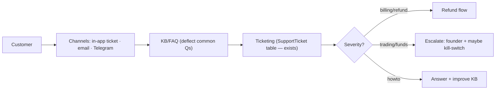

# 🛠️ BUSINESS OPERATIONS — MASTER PLAN

**How one founder runs a real-money SaaS without drowning — and what to automate/hire first.**

> ⚠️ Operations for a financial product = incidents have **money + legal** consequences. Build the **kill-switch + alerting + support** before you scale users.
>
> See also: [Founder](./FOUNDER_MASTER_PLAN.md) · [Deploy/observability](./PRODUCTION_DEPLOYMENT_MASTER_PLAN.md) · [Admin](./ADMIN_PORTAL_MASTER_PLAN.md) · [Legal](./LEGAL_AND_COMPLIANCE_MASTER_PLAN.md).

---

## Executive Summary

- As a **solo founder**, you wear every hat — so **automate or template everything possible** and **outsource compliance/finance to a CA** from day one of incorporation.
- The non-negotiables for a trading product: a **global kill-switch**, **alerting** (tick-stall, exchange-ban, balance-drift), **clear support + refund flow**, and **audit logs** (already exist).
- **First hires** (only when revenue justifies): ① part-time **support/VA**, then ② a **second engineer**. Compliance/finance stays outsourced (CA + lawyer on retainer) far longer.

---

## 1. Operating model — who does what (solo → small team)

| Function | Solo (now) | Outsource | First hire |
|---|---|---|---|
| **Founder** | strategy, product, eng, oversight | — | — |
| **Engineering** | you (Claude Code) | — | 2nd eng @ ~Phase 7 |
| **Support** | you (email/Telegram) | KB/FAQ deflect | VA/support @ ~50–100 users |
| **Compliance** | positioning + docs | **lawyer (retainer)** | — (stay outsourced) |
| **Finance/Tax** | track revenue | **CA (retainer)** | — (stay outsourced) |
| **Security** | you (checklist) | pentest later | — |
| **Monitoring/Incident** | you (alerts → phone) | uptime/Sentry | on-call as team grows |

---

## 2. Customer support system

| Component | Plan |
|---|---|
| **Ticketing** | `SupportTicket` table already exists → simple in-app + email; later a tool (Crisp/Chatwoot — cheap/OSS) |
| **Email support** | a shared inbox (support@) → SLA: 24h first response (priority faster for Pro) |
| **Knowledge base** | setup guide, API-key how-to, risk FAQ, "why no trades?", troubleshooting |
| **FAQ** | safety, fees, refunds, "does it guarantee profit?" (honest "no") |
| **Refund handling** | clear policy (SaaS fees, **not** trading losses); process within X days; log in audit |
| **Escalation** | trading/funds/security issues → founder immediately; consider **kill-switch** |
| **Incident comms** | status page + broadcast (admin broadcast exists) |

> **Deflection first:** a good KB/FAQ + the dashboard's "why gated" transparency removes most tickets (users panic when they see "no trades" — explain it proactively).

---

## 3. Compliance & finance ops

- **Monthly:** GST returns, bookkeeping, payout↔invoice reconciliation, FIRC for forex (CA-driven).
- **Quarterly/Annual:** TDS, ITR, ROC filings, statutory audit (CA).
- **Ongoing:** keep legal docs current; review marketing copy for claims; re-check region rules before expansion.
- **Records:** retain invoices, FIRC, consent logs (`AuditLog`), KYC (if applicable) — for tax + disputes.

## 4. Security ops

(Full detail in [Deploy doc §5](./PRODUCTION_DEPLOYMENT_MASTER_PLAN.md).) Day-to-day:
- Secrets in a manager; **rotation runbook**; never commit secrets (enforced — `.env` gitignored).
- Exchange keys trade-only, withdrawals off; encourage IP allow-list.
- 2FA for admin; least-privilege DB; dependency + secret scanning.
- Nightly encrypted DB backup + **monthly restore drill**.

## 5. Monitoring & incident management

| Alert | Action |
|---|---|
| Bot tick stalled / sweep frozen | page → investigate worker |
| Exchange ban / key invalid | auto-pause affected users + notify |
| **Balance drift** (DB vs exchange) | page — possible bug; consider halt |
| Drawdown kill-switch fired | notify operator |
| Payment webhook fail | reconcile manually |
| Error-rate spike (Sentry) | triage |

**Incident severities & the kill-switch** → [Deploy doc §8](./PRODUCTION_DEPLOYMENT_MASTER_PLAN.md). **Write runbooks** for: exchange-ban recovery, key rotation, DB restore, stuck tick, payment replay, global halt + resume.

## Cost Estimates

| Item | Cost |
|---|---|
| CA + lawyer retainers | ₹40–80k/yr combined |
| Support tool (Crisp/Chatwoot OSS) | ₹0–2k/mo |
| Uptime/Sentry/status page | ₹0 (free tiers) |
| First VA/support hire | ₹15–30k/mo (at ~100 users) |

## Risks

- **Founder bottleneck/burnout** → automate + KB + hire support early.
- **Slow incident response on a money bug** → alerting + kill-switch are mandatory.
- **Refund/chargeback disputes** → clear policy + records.
- **Compliance lapse** (missed filing) → CA retainer prevents penalties.

## Alternatives

- OSS self-hosted support (Chatwoot) to stay cheap.
- Async-only support (no live chat) early to protect founder time.

## Step-by-Step Actions

1. Stand up **KB + FAQ + ticketing** (table exists) before public launch.
2. Wire **alerting + kill-switch** (operational safety).
3. Retain **CA + lawyer**.
4. Write the **runbooks**.
5. Hire **support/VA** at ~50–100 users; **2nd engineer** at Phase 7.

## Timeline

Support + alerting before **public launch (Phase 6)**; first hire ~**Phase 7–8**.

## Priority Checklist

- [ ] Global **kill-switch** + trading alerts live.
- [ ] KB/FAQ + ticketing + refund flow.
- [ ] CA + lawyer retainers.
- [ ] Backups + restore drill + runbooks.
- [ ] Hire support → then engineer, only when revenue justifies.
