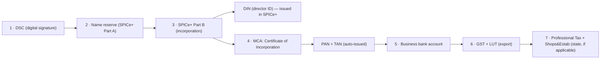

# 🏢 COMPANY FORMATION — GUIDE (India)

**Choosing & registering the right legal entity for an AI crypto-trading SaaS, plus business banking.**

> ⚠️ **NOT legal/financial advice.** Verify with a **Company Secretary (CS) + Chartered Accountant (CA)**. Govt fees, stamp duty (state-wise), and rules change. Crypto/FinTech may trigger extra bank/processor underwriting.
>
> See also: [Founder roadmap](./FOUNDER_MASTER_PLAN.md) · [Tax](./TAX_AND_ACCOUNTING_MASTER_PLAN.md) · [Payments](./PAYMENT_GATEWAY_MASTER_PLAN.md).

---

## Executive Summary

- **Don't incorporate until ~Phase 4** (near first revenue). Early on, the cost + compliance of a company is dead weight.
- **When you do: register a Private Limited Company.** It's the only structure that is fully **investor-ready** (equity, ESOPs, convertible notes), qualifies for **DPIIT Startup India** + the **Section 80-IAC 3-year tax holiday**, and signals credibility to banks/processors/customers.
- **OPC** is a reasonable *solo* middle path but you'll **convert to Pvt Ltd to raise** anyway → most go straight to Pvt Ltd.
- **LLP** only if you'll **never raise VC** and want lower compliance (bootstrap-forever services play).
- **Sole Proprietorship** only for the earliest pre-revenue testing — **not** for a real FinTech SaaS (unlimited personal liability is dangerous for a trading product).

---

## 1. Structure comparison

| Factor | Sole Prop | OPC | LLP | **Private Ltd** ✅ |
|---|---|---|---|---|
| Setup cost | ~₹0–3k | ~₹8–15k | ~₹7–12k | ~₹15–35k |
| Annual compliance | minimal | medium (₹15–30k) | low–medium (₹10–25k) | higher (₹25–50k+) |
| Liability | **unlimited (risky)** | limited | limited | **limited** |
| Taxation | individual slab | 25%/22%* | 30% flat | 22%* (115BAA) |
| Investor-ready | ❌ | ⚠️ (convert) | ⚠️ (no shares/ESOP) | ✅ **best** |
| ESOPs | ❌ | ❌ | ❌ | ✅ |
| Startup India / 80-IAC | ❌ | limited | limited | ✅ |
| SaaS suitability | low | ok | good | **best** |
| FinTech credibility | low | medium | medium | **high** |
| Future scaling | poor | convert needed | limited | **excellent** |

\*New-regime corporate rate ~22% + surcharge/cess (subject to conditions); confirm with a CA.

**Recommendation & why:** **Private Limited Company.** For a product you intend to scale globally and possibly fund, it's the path of least future friction — limited liability (critical for a trading product), investor + ESOP ready, tax-holiday eligible, and trusted by banks/processors. The extra compliance is worth it *once you have revenue*; until then, stay an individual.

---

## 2. Registration process (Private Limited)

| Step | What | Time | Cost (₹) | Documents |
|---|---|---|---|---|
| **DSC** | Class-3 digital signature for director | 1–2 d | ~1–2k | PAN, Aadhaar, photo, email/mobile |
| **Name** | SPICe+ Part A reservation | 1–3 d | ₹1k | 2 name options + objects |
| **SPICe+ Part B** | incorporation form (MoA/AoA, DIN, PAN, TAN, EPFO, ESIC, bank, optional GST) | 5–10 d | govt fee + stamp duty (state) | ID/address proof, registered-office proof (rent + NOC/utility bill) |
| **Certificate of Incorporation (CIN)** | from MCA | included | — | — |
| **PAN / TAN** | auto with COI | included | — | — |
| **Bank account** | current account | 2–5 d | ₹0 | COI, PAN, board resolution, KYC |
| **GST** | if turnover > ₹20L *or* voluntary (recommended for B2B/exports) | 3–7 d | ₹0 | COI, PAN, bank, office proof |
| **LUT** | export services without paying IGST (zero-rated) | 1 d | ₹0 | GST login |
| **Professional Tax** | state (e.g., KA/MH) if employees | varies | varies | state portal |
| **Shops & Establishment** | state, if commercial premises/employees | varies | varies | state portal |

- **Total:** ~₹15–35k incl. professional (CA/CS) fees; **7–15 working days**.
- **Registered office:** can be a residential address (with owner NOC + utility bill) early on.

> 🇮🇳 **FinTech note:** your business object/SAC should describe **software/SaaS** ("development & supply of software / platform services", SAC 9983/998314), **not** "trading", "investment advisory", "portfolio management", or "broking" — those imply regulated activity. Get the objects worded by a CS who understands the positioning ([Legal doc](./LEGAL_AND_COMPLIANCE_MASTER_PLAN.md)).

---

## 3. Business banking (India SaaS)

| Bank | Strengths | Watch-outs | Fit |
|---|---|---|---|
| **ICICI** (InstaBIZ / iStartup) | best digital current account, startup program, decent inward-remittance/FIRA | crypto-linked underwriting scrutiny | 🏆 **top pick** |
| **Kotak** (811 Biz) | excellent digital UX, startup-friendly, low friction | smaller branch network | 🥈 strong |
| **Axis** | good API/CA, startup tie-ups | UX varies | good |
| **HDFC** (SmartUp) | wide, reliable, popular | more paperwork, conservative on crypto | good |
| **SBI** | cheapest, widest, govt trust | slow digital, slower forex/FIRA | budget/branch |

**Recommendation:** **ICICI or Kotak** — digital-first, integrate cleanly with Razorpay/Cashfree, and handle **inward foreign remittance (FIRC/FIRA)** which you'll need for export-of-services tax benefits. Pick whichever underwrites the "crypto trading software" description without friction (call ahead).

> ⚠️ Banks can be wary of "crypto" in the business description. Describe the business accurately as **software/SaaS subscriptions**; you are **not** a crypto exchange, broker, or fund (non-custodial). Have your CA help phrase the account-opening forms.

---

## Cost Estimates (summary)

| Item | One-time | Recurring |
|---|---|---|
| Incorporation (Pvt Ltd) | ₹15–35k | — |
| Accounting/CA | — | ₹25–40k/yr |
| ROC annual filings (AOC-4, MGT-7) | — | included in CA |
| Auditor (statutory, mandatory for Pvt Ltd) | — | ₹15–30k/yr |
| DPIIT Startup India | ₹0 | ₹0 |

---

## Risks

- Wrong objects wording → bank/processor/regulator friction. (Mitigate: CS + software positioning.)
- Incorporating too early → burning cash on compliance pre-revenue.
- Forgetting statutory filings → penalties (Pvt Ltd has real annual obligations). **Hire a CA from day one of incorporation.**
- Personal liability if you operate as proprietor at scale → incorporate before meaningful revenue.

## Alternatives

- **OPC** if you want limited liability solo *now* but aren't sure about raising (convert later).
- **US Delaware C-Corp via Stripe Atlas** *if* going global-first and Stripe/US payments are essential — but adds US compliance + crypto-acceptance risk; usually overkill for an India-based solo founder. ([Payments doc](./PAYMENT_GATEWAY_MASTER_PLAN.md))

## Step-by-Step Actions

1. Validate first (don't form yet).
2. Engage a **CS + CA** (~₹15–35k package).
3. Get DSC → reserve name → file SPICe+ → CIN/PAN/TAN.
4. Open ICICI/Kotak current account.
5. Register GST + file LUT (for exports).
6. Apply DPIIT Startup India (free) → 80-IAC tax holiday.
7. Set up bookkeeping with the CA.

## Timeline

~2–3 weeks end-to-end once you start (Phase 4).

## Priority Checklist

- [ ] Validate + reach near-first-revenue **before** incorporating.
- [ ] Pvt Ltd via CS/CA, software-worded objects.
- [ ] ICICI/Kotak current account.
- [ ] GST + LUT (exports).
- [ ] DPIIT Startup India recognition.
- [ ] CA on retainer for filings.
