# 🏛️ FINAL TRADING AGENT — MASTER PLAN

**A production-grade blueprint to evolve DS2AuraTrading into a world-class, capital-preserving, multi-exchange AI crypto trading platform — at near-zero cost.**

> **Audience:** founder/operator + engineers.
> **Philosophy:** *Capital preservation first. Avoid bad trades. Boring, consistent, cheap, automated.*
> **Companion docs:** [`07-ai-ml-llm-roadmap.md`](./07-ai-ml-llm-roadmap.md) (ML/LLM detail) · [`08-how-the-bot-works-today.md`](./08-how-the-bot-works-today.md) (current system).
>
> ⚠️ **Honest disclaimer (read once):** No system "wins every trade." Crypto is non-stationary and adversarial. The realistic edge here is **fewer bad trades, smaller drawdowns, faster adaptation, and low cost** — not certainty. Every change is proven in **paper** before it risks a cent.

---

## 📑 Table of Contents

0. [Prerequisites — what we need, what we pay, what we already have](#0-prerequisites)
1. [Executive Summary](#1-executive-summary)
2. [Current State Audit](#2-current-state-audit)
3. [Architecture Review](#3-architecture-review)
4. [Model Comparison Matrix](#4-model-comparison-matrix)
5. [Agent Design](#5-agent-design)
6. [Trading System Design](#6-trading-system-design)
7. [Risk Management Framework](#7-risk-management-framework)
8. [Cost Optimization Plan](#8-cost-optimization-plan)
9. [Infrastructure Design](#9-infrastructure-design)
10. [Deployment Plan](#10-deployment-plan)
11. [Backtesting Framework](#11-backtesting-framework)
12. [Security Framework](#12-security-framework)
13. [Implementation Roadmap](#13-implementation-roadmap)
14. [Phase-by-Phase Checklist](#14-phase-by-phase-checklist)
15. [Final Recommended Architecture](#15-final-recommended-architecture)
16. [Final Recommended Model Stack](#16-final-recommended-model-stack)
17. [Final Recommended Agent Stack](#17-final-recommended-agent-stack)
18. [Final Cost Breakdown](#18-final-cost-breakdown)
19. [Expected Benefits](#19-expected-benefits)
20. [Priority Actions](#20-priority-actions)

---

## 0. Prerequisites

> Everything needed to **build & run V2**, split four ways: **✅ already have** (no new cost),
> **🆕 need to get**, **💸 what you pay**, and **🚫 what you do NOT need** (so no money is wasted).
> The full cost model is in [§18](#18-final-cost-breakdown).

### 0.1 ✅ Already have (present in V1 — reuse, don't re-buy)

| Item | Status |
|---|---|
| Codebase + architecture (Express · Prisma · Next.js · Postgres · Redis-ready) | ✅ copied into V2 |
| Binance USDT-M Futures integration (per-user client + rate-limit circuit breaker) | ✅ |
| Multi-tenant auth · AES-256-GCM key encryption · JWT · 2FA · RBAC | ✅ |
| Deterministic rule engine + protection (SL / TP / break-even / trailing) | ✅ |
| Paper-trading mode (simulate on live prices, no real orders) | ✅ |
| Opt-in adaptive learning (per-coin score bar) | ✅ |
| Supabase Postgres (database) | ✅ free tier |
| GitHub (V1 + the new **private** V2 repo) | ✅ |
| Railway deploy pipeline (V1) | ✅ |
| Claude Code (development assistant) | ✅ your subscription |
| Full plan + current-system docs (`07` / `08` / this file) | ✅ |

→ **The entire foundation already exists.** V2 *adds layers on top* — it does not rebuild.

### 0.2 🆕 Need to get (new for V2, by phase)

| Phase | What you need | Cost |
|---|---|---|
| **P0 / P1** (data + risk) | *(optional)* a **separate Supabase project** for V2 testing; a Binance **sub-account / testnet** to test safely | free |
| **P2** (ML) | Python 3.11 + **LightGBM** + **onnxruntime** (all open-source); somewhere to run a **weekly** training job (your laptop or the VPS) | free |
| **P3** (LLM sentiment) | **one** cheap LLM API key — **DeepSeek** *or* **Gemini (free tier)** *or* **Claude Haiku**; a **free** news source (CryptoPanic free / RSS) | ~free |
| **P4** (multi-exchange) | **test accounts + trade-only API keys** on Bybit / OKX / Bitget / CoinEx (production keys belong to the *users*, not you) | free |
| **P6** (infra / prod) | a cheap **VPS** (Hetzner / Contabo) · *(optional)* a **domain** · **Cloudflare** (free) · **Sentry** (free tier) · a **secrets manager** (Doppler / Infisical free tier) | mostly free |
| Dev tooling | Node 20+ · Docker · Git | already installed |

### 0.3 💸 What you pay (realistic, recurring)

| Item | When | Cost | Notes |
|---|---|---|---|
| VPS (production) | P6 / go-live | **$6–13/mo** | Hetzner CX22/CX32 — **flat** to ~100 users |
| Supabase | at scale | **$0 → $25/mo** | free tier is fine for dev + small prod |
| LLM sentiment | P3 | **~$1–4/mo total** | **shared** across all users → stays flat |
| Domain (optional) | go-live | **~$10/yr** | nice-to-have, not required |
| Sentry · Cloudflare · secrets mgr | P6 | **$0** | free tiers |
| ML training compute | P2+ | **~$0** | CPU, weekly, on the VPS/laptop |
| **To START building (P0–P2)** | now | **$0** | nothing new to buy |
| **At production (≤100 users)** | go-live | **~$8–15/mo** | full detail in [§18](#18-final-cost-breakdown) |

→ **You can build P0, P1 and P2 for $0.** The first real dollar is the optional LLM key (P3) and the VPS (P6).
→ **Live trading needs a funded exchange account — but that's the *user's* money, not a platform cost. Paper mode needs no funds.**

### 0.4 🚫 What you do NOT need (don't waste money)

- ❌ **No GPU / ML rig** — LightGBM runs on CPU; the LLM is a hosted API.
- ❌ **No Kubernetes / AWS / GCP** — overkill until ~1,000+ users; one VPS is plenty.
- ❌ **No paid market-data feed** — exchange public endpoints (klines / funding / OI / depth) are free.
- ❌ **No paid news / terminal** (Bloomberg, paid TradingView, paid news API) — free RSS / CryptoPanic to start.
- ❌ **No expensive frontier LLM at runtime** — sentiment is a cheap-model job; never pay Opus/GPT-5 per tick.
- ❌ **No multi-LLM "agent swarm"** — slow, costly, fragile; use 5 deterministic services + 1 cheap LLM ([§17](#17-final-recommended-agent-stack)).
- ❌ **No new database tech** — Postgres + Redis (already in the stack) cover everything; no Mongo/Kafka/ClickHouse yet.
- ❌ **No microservices / event bus / message queue** at this scale — a monolith + worker is simpler and more reliable.
- ❌ **No LLM placing or sizing trades — ever** (capital risk + hallucination).

### 0.5 🧑‍🔧 You (operator) prerequisites

- Comfortable (or willing) with **basic Docker / Linux** for the VPS — or stay on Railway and skip it.
- **Discipline to validate paper → shadow → small-live** before full live (weeks, not hours).
- A **funded exchange account only when going live** (paper needs none).

---

## 1. Executive Summary

DS2AuraTrading today is a **solid, lean, deterministic rule-based futures bot** — well-architected, multi-tenant, safety-conscious, and cheap. It is **not** broken. But to become *world-class* and *capital-preservation-first*, it needs four upgrades, in priority order:

| # | Upgrade | Why it matters most |
|---|---|---|
| 🥇 | **Institutional risk layer** (portfolio drawdown kill-switch, exposure/correlation caps, vol-scaled sizing, circuit breakers) | This is the single biggest lever for "preserve capital / avoid large drawdowns". Today's risk is **per-trade**; world-class risk is **portfolio-level**. |
| 🥈 | **ML conviction layer** (gradient-boosted model in *shadow → gate* mode) | Cuts losing trades by filtering low-probability setups the rules alone let through. |
| 🥉 | **Multi-exchange adapter** (Binance, Bybit, OKX, Bitget, CoinEx) | Unlocks growth; the schema already has an `exchange` field, but the client is Binance-only. |
| 4️⃣ | **Cheap, shared LLM sentiment** (news/event-risk → features) | Avoids trading into hacks/depegs/black-swans. LLM **never** trades — feature only. |

**What we will NOT do:** chase trade frequency, add leverage, build a 10-LLM "agent swarm" (slow, costly, fragile), or let any LLM place an order. **Fewer, higher-quality trades win.**

**Cost target:** **< $20/month** for production up to ~100 users; the deterministic core is CPU-light and the only variable cost (LLM sentiment) is **shared across all users** → it stays flat as you grow.

**Headline recommendations:**
- **Infra:** move production from Railway → **one Hetzner/Contabo VPS** (Docker Compose: API + worker + Redis) + keep **Supabase Postgres**. ~70% cheaper, simpler, faster.
- **Agents:** collapse the "10 agents" idea into **5 deterministic services + 1 optional cheap LLM** — most "agents" should be functions, not LLM calls.
- **Models:** **Claude for development**, **DeepSeek/Gemini-Flash for the product's cheap LLM**, **LightGBM as the trading "model"** (an LLM is the wrong tool for price prediction).

---

## 2. Current State Audit

### 2.1 What exists (grounded in the code)

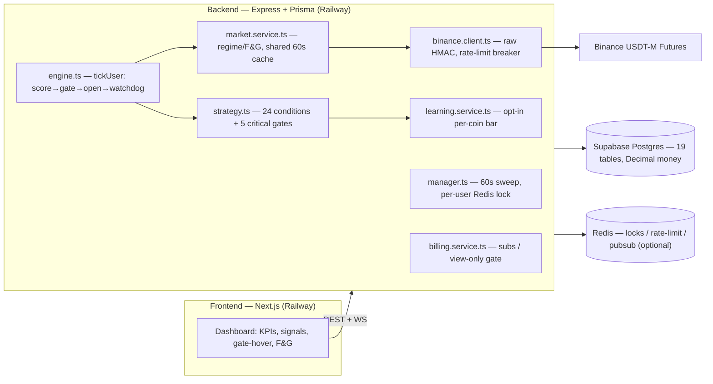

### 2.2 Strengths (keep these)

- ✅ **Deterministic & explainable** — no black box; every decision traceable (the dashboard already shows *why gated*).
- ✅ **True multi-tenant isolation** — per-user encrypted keys; `BinanceClient` is instantiated per user; nearly every row carries `userId`.
- ✅ **Money-safe data model** — `Decimal(38,18)`, good indexes, 19 well-named tables.
- ✅ **Rate-limit circuit breaker** — `-1003` ban handling that stops blocked-but-attempted calls (textbook correct).
- ✅ **Shared market cache** — regime/F&G computed **once for all tenants** (the key cost lever).
- ✅ **Layered protection** — server-side `STOP_MARKET` + software watchdog fallback; net-of-fee P&L.
- ✅ **Paper-first default** — new users simulate before risking funds.

### 2.3 Weaknesses & risks (fix these)

| Area | Finding | Severity |
|---|---|---|
| **Risk mgmt** | Only **per-trade** + daily-cap + loss-streak. **No** portfolio drawdown kill-switch, **no** exposure/correlation caps, **no** volatility-scaled sizing. | 🔴 High |
| **Position sizing** | Fixed `marginPerTradeUsd` (flat $). Doesn't scale to equity or volatility → inconsistent risk-per-trade. | 🔴 High |
| **Multi-exchange** | Schema has `exchange` field, but code is **Binance-only** (`BinanceClient` hardcoded). No adapter abstraction. | 🟠 Med |
| **Single-IP rate limit** | All tenants share one egress IP → one `-1003` ban freezes **everyone**. | 🟠 Med |
| **No ML / conviction filter** | Rules alone; no probability model to veto low-edge setups. | 🟠 Med |
| **No event/news guard** | No protection against hacks/depegs/listing-delist/black-swan headlines. | 🟠 Med |
| **Redis optional/in-memory** | Falls back to a single-process memory shim → locks/pubsub break across replicas if Redis missing. | 🟡 Low |
| **No feature store** | Outcomes logged (`TradeHistory`) but not the **full feature vector at decision time** → can't train ML yet. | 🟡 Low |
| **Condition-count drift** | UI says "19-point", strategy is ~24 — cosmetic inconsistency. | 🟢 Trivial |
| **In-process worker** | Bot ticks inside the API process by default → a heavy request can delay a tick. | 🟢 Trivial |

---

## 3. Architecture Review

### 3.1 Verdict

The architecture is **right-sized and good**. Do **not** rewrite it. The correct move is **additive**: insert a risk layer and a conviction layer into the existing tick, abstract the exchange client, and (optionally) split the worker out. Resist micro-services / Kubernetes / event-bus complexity — at this scale they are **cost and reliability liabilities**, not benefits.

### 3.2 Target architecture (additive)

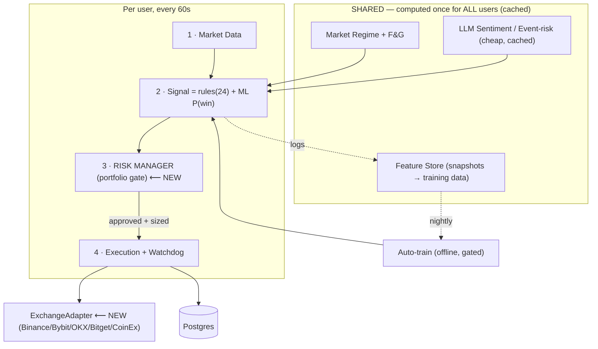

**Three inserts, zero rewrite:**
1. **RISK MANAGER** between *signal* and *execution* — the new portfolio-level veto + sizing brain.
2. **ML conviction** inside the signal step (shadow → gate).
3. **ExchangeAdapter** behind execution/data so non-Binance exchanges plug in.

---

## 4. Model Comparison Matrix

> Two different questions: **(A)** which model helps *you build* the software, **(B)** which model the *product* uses at runtime. They are different. Scores are 1–10, **approximate**, early-2026; **verify live pricing before committing**.

### 4.1 Matrix

| Model | Quality | Latency | Cost | Reasoning | Coding | Trading-text analysis | Notes |
|---|:--:|:--:|:--:|:--:|:--:|:--:|---|
| **Claude (Opus/Sonnet 4.x)** | 10 | 7 | 3 | 10 | 10 | 8 | Best agentic coding & long multi-file reasoning. Premium price. |
| **OpenAI GPT-5.x** | 9 | 7 | 4 | 9 | 9 | 8 | Strong all-round; good tools/ecosystem. |
| **Google Gemini 2.x/3 (Pro)** | 9 | 7 | 6 | 9 | 8 | 8 | Huge context, web-grounding, **generous free tier**. |
| **Google Gemini Flash** | 7 | 9 | 9 | 7 | 7 | 7 | **Cheap + fast**; great for the product's sentiment task. |
| **DeepSeek V3.x / R1** | 8 | 7 | 10 | 9 | 9 | 7 | **Cheapest capable** coder/reasoner. Superb $/quality. |
| **xAI Grok 3/4** | 8 | 7 | 5 | 8 | 7 | **9** | **Real-time X/social** access → uniquely useful for crypto *sentiment*. |
| **Qwen2.5/3-Coder (OSS)** | 7 | 8* | 10 | 7 | 8 | 6 | Run **free locally** (Ollama). *Latency = your hardware. |
| **Llama / Mistral-Codestral (OSS)** | 6 | 8* | 10 | 6 | 7 | 5 | Free local fallback; weaker on hard reasoning. |

### 4.2 Recommendations

| Role | Winner | Cheap alternative |
|---|---|---|
| 🧑‍💻 **Best Coding Model** | **Claude (Opus/Sonnet)** | DeepSeek V3.x · Qwen2.5-Coder (local) |
| 🔬 **Best Research Model** | **Gemini Pro** (context + grounding) | Claude · DeepSeek |
| 📈 **Best Trading-Analysis Model** | ⚠️ **None directly — use the ML model (LightGBM).** For *news/social text → features*: **Grok** (real-time) or **Gemini Flash** | DeepSeek |
| 💸 **Best Cheap Model** | **DeepSeek** (API) / **Gemini Flash** (free tier) | Qwen local (free) |
| 🏆 **Best Overall** | **Claude** for building; **hybrid** for the product (see below) | — |
| 🧩 **Best Hybrid Stack** | **Claude (dev)** + **DeepSeek or Gemini-Flash (product sentiment, shared/cached)** + **LightGBM (the trading model)** + optional **Grok (real-time social spike detection)** | — |

> 🔑 **The most important model insight:** **an LLM is the wrong tool to predict price or place trades.** Use a **tabular ML model** for conviction and a **cheap LLM only to read text** (news/sentiment) into numeric features. Anyone selling "GPT trades crypto for you" is selling risk.

---

## 5. Agent Design

### 5.1 Reality check — "agents" should mostly be **functions, not LLM calls**

A 10-LLM agent swarm is **slow, expensive, and fragile** (each call adds latency, cost, and a failure mode). For a 60-second trading loop, **determinism wins**. We collapse the long wish-list into **5 deterministic services + 1 optional cheap LLM + 1 offline job**.

### 5.2 Keep / Merge / Remove

| Proposed agent | Decision | Rationale |
|---|---|---|
| Market Data Agent | ✅ **Keep** (deterministic) | Fetch/normalize OHLCV, funding, OI, depth. |
| Technical Analysis Agent | ✅ **Keep** = the rule engine + ML | This is the core signal. |
| Risk Manager Agent | ✅ **Keep — NEW, top priority** | Portfolio-level veto + sizing. |
| Execution Agent | ✅ **Merge** with Monitoring | Place orders + watch them = one watchdog loop. |
| Monitoring Agent | ✅ **Merge into Execution** | Same loop already (`runWatchdog`). |
| Sentiment Agent | ✅ **Keep — LLM, cheap, shared, cached** | News/event-risk → features. The *only* LLM. |
| Macro Analysis Agent | 🔁 **Merge into Market/Regime** | BTC trend + F&G already cover the 80%. Don't pay an LLM for this. |
| Portfolio Manager Agent | 🔁 **Merge into Risk Manager** | Exposure/correlation = risk functions, not a separate brain. |
| Trade Validator Agent | 🔁 **Merge into Risk Manager** | Final pre-flight = the risk gate's job. |
| Learning Agent | 🔁 **Demote to offline job** | Retraining is a scheduled batch, not a live agent. |

### 5.3 Final agent flow

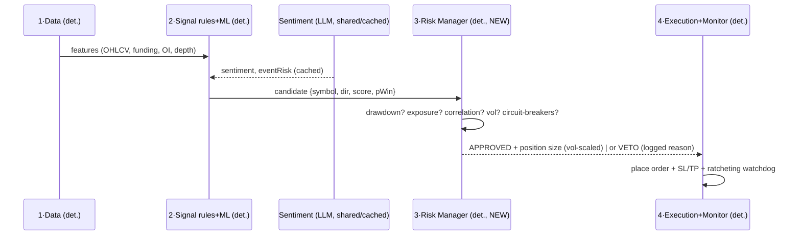

---

## 6. Trading System Design

### 6.1 Weighted signal framework (extend what exists)

Today's ~24 conditions cover trend/momentum/volatility/volume/structure. **Add the missing market-microstructure categories** and normalize into a 0–100 conviction score, **multiplied** by ML `P(win)`:

| Category | Example signals | Weight (start) | Status |
|---|---|:--:|---|
| Trend | EMA stack, VWAP, multi-TF agreement | 20 | ✅ have |
| Momentum | RSI pullback, MACD | 15 | ✅ have |
| Volatility | ATR regime, BB width | 10 | ✅ have |
| Volume | rel-volume, surge | 10 | ✅ have |
| Market structure | BOS/CHOCH, S/R, sweeps | 15 | ✅ have |
| **Funding rate** | extreme/!crowded | 8 | ⚠️ partial |
| **Open interest** | OI rising with price (conviction) vs divergence | 8 | ❌ add |
| **Liquidity / depth** | order-book imbalance, spread | 7 | ⚠️ partial |
| **Order flow / CVD** | aggressive buy/sell delta | 7 | ❌ add |
| **Sentiment / event** | LLM news score, event-risk veto | (gate) | ❌ add |

```
finalConviction = Σ(weightᵢ × passᵢ) normalized 0–100
trade IF  direction clear
      AND finalConviction ≥ threshold (regime-adjusted)
      AND ML.pWin ≥ τ            # conviction gate
      AND all CRITICAL gates pass # spread, !HIGH_RISK, BTC-aligned, funding, ADX, eventRisk≠high
      AND Risk Manager APPROVES   # §7
```

### 6.2 Entry / Exit / TP / SL / sizing — upgrades

| Element | Today | Upgrade |
|---|---|---|
| **Entry** | score ≥ bar + gates | + ML `pWin` gate + OI/CVD confirmation |
| **Exit** | SL/TP/break-even/trailing (+5% cap) | keep; add **time-stop** (close stale flat trades) + **regime-flip exit** |
| **TP** | single or scaled ladder | keep scaled ladder; make TP1 auto-arm break-even (already does) |
| **SL** | fixed `slPercent` | **ATR-based** SL (adapts to volatility) — wider in chop, tighter in calm |
| **Sizing** | fixed `$marginPerTradeUsd` | **risk-per-trade = fixed % of equity**, **volatility-targeted**, **fractional-Kelly capped** — see §7.3 |
| **Leverage** | fixed | **cap by volatility & bracket**; never increase to "make up" losses |
| **Regime** | SAFE/MOD/HIGH_RISK + BTC trend | keep; feed regime into threshold + sizing (smaller in HIGH_RISK) |

> 🎯 The biggest *profitability* win is **better sizing + an ML veto**, not more signals. Risk-adjusted returns improve when each trade risks a *consistent, volatility-aware* slice of equity and low-edge trades are filtered out.

---

## 7. Risk Management Framework

> **This section is the heart of "capital preservation first." It is the highest-priority build.** Today the bot protects each *trade*; institutional risk protects the *account*.

### 7.1 Loss limits & kill-switches (NEW)

| Guard | Rule (example, configurable) | Action when breached |
|---|---|---|
| **Daily loss limit** | realized+unrealized ≤ −2% of equity/day | pause new trades until next day |
| **Weekly loss limit** | ≤ −5%/week | pause until next week |
| **Monthly loss limit** | ≤ −10%/month | pause + alert operator |
| **Max drawdown kill-switch** | equity ≤ −15% from high-water mark | **STOP everything**, flatten optional, require manual resume |
| **Consecutive-loss** | (exists) 3 in a row | cooldown (exists) |
| **Per-trade risk** | ≤ 0.5–1% equity at SL | reject oversized trades |

### 7.2 Exposure, correlation & circuit breakers (NEW)

| Guard | Rule |
|---|---|
| **Position limit** | ≤ N concurrent (exists: 3) — keep |
| **Gross exposure cap** | Σ notional ≤ X× equity (e.g. ≤ 3×) |
| **Per-asset cap** | ≤ Y% equity in one coin |
| **Correlation cap** | block adding a 4th highly-correlated alt-long (they crash together); treat correlated longs as one bet |
| **Sector/beta cap** | limit total "alt-beta-to-BTC" exposure |
| **Volatility circuit breaker** | if BTC 1h ATR spikes > threshold → pause new entries |
| **Spread/illiquidity breaker** | widen-spread → skip (exists, extend) |
| **News/event breaker** | LLM `eventRisk: high` (hack/depeg/regulatory) → block new entries on that asset |
| **Black-swan breaker** | sudden −X% market-wide move → flatten/stop, require manual resume |
| **Data-stale breaker** | if feeds stale/contradictory → fail safe (no trade) |

### 7.3 Position sizing (the quiet super-power)

```
riskPerTrade$   = equity × riskPct            # e.g. 0.5–1%
slDistance      = ATR-based stop distance
positionSize    = riskPerTrade$ / slDistance  # risk-normalized, NOT fixed $
sizeMultiplier  = clamp( f(volTarget/realizedVol) × f(pWin) , 0.25 , 1.0 )
finalSize       = min( positionSize × sizeMultiplier , exposure & margin caps )
```
- **Risk-per-trade is constant in % of equity**, so a loss streak shrinks size automatically (anti-martingale) and wins compound.
- **Volatility targeting** keeps portfolio risk steady across calm/wild regimes.
- **Fractional-Kelly cap** prevents over-betting on a "sure thing."

### 7.4 Risk decision flow

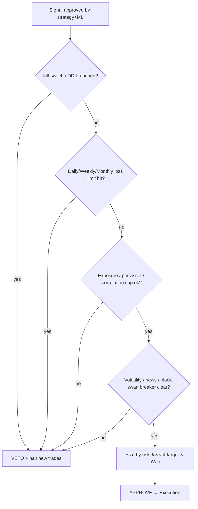

---

## 8. Cost Optimization Plan

### 8.1 Cost levers (ranked)

1. **Run the deterministic core on one cheap VPS** (not autoscaling PaaS). It's CPU-light.
2. **Compute shared things once** — regime, sentiment, news are *global*, cached, reused by all users. **This makes LLM cost flat, not per-user.**
3. **ML inference in-process via ONNX** — no GPU, no extra service.
4. **Train offline & weekly** — training is the heavy part; never live.
5. **Cheapest LLM that passes the bar** for sentiment (DeepSeek/Gemini-Flash), batched, content-hash cached.
6. **Free data first** — Binance/exchange public endpoints, CryptoPanic/RSS news.
7. **Hard monthly $ cap** on any paid API with auto-disable → fall back to free rules.

### 8.2 Where today's money goes vs target

| Item | Today (Railway+Supabase) | Target (VPS+Supabase) |
|---|---|---|
| Compute | Railway 2 services (usage-billed, scales up) | 1 Hetzner/Contabo VPS (flat) |
| DB | Supabase | Supabase (keep) or self-host on VPS |
| Redis | Railway plugin / external | self-host on same VPS (Docker) |
| LLM | none | shared sentiment ~cents–$2/day total |
| **Est.** | **~$15–40+/mo (grows)** | **~$6–15/mo (flat to ~100 users)** |

---

## 9. Infrastructure Design

### 9.1 Provider comparison

| Provider | $/mo (≈prod box) | Pros | Cons | Verdict |
|---|---|---|---|---|
| **Railway** (today) | usage, ~$10–40+ | zero-ops, easy deploy, auto-deploy | costs climb with usage; less control; shared IP | good to **start** |
| **Hetzner Cloud** | €4–12 (CX22/CX32) | **best price/perf**, reliable, EU/US | need basic Linux ops | 🏆 **prod winner** |
| **Contabo** | $5–10 | cheapest RAM/vCPU | noisier neighbors, support | budget alt |
| **DigitalOcean** | $6–24 | great DX/docs, managed DB | pricier than Hetzner | solid mid |
| **AWS/GCP** | $$$ + complexity | infinite scale, managed everything | overkill, expensive, easy to overspend | **only at 1k+ users** |

### 9.2 Recommended per environment

| Env | Stack | Cost |
|---|---|---|
| **Development** | local (Docker compose) + Supabase free + DeepSeek/Gemini-free + paper | **~$0–5** |
| **Testing/Staging** | 1 small VPS (Hetzner CX22) or Railway hobby, **paper/shadow only** | **~$5–8** |
| **Production** | 1 Hetzner CX32 (4 vCPU/8GB): Docker Compose = API + worker + Redis + Caddy/Cloudflare; **Supabase** Postgres; nightly DB backup | **~$8–15** |
| **Enterprise (1k+)** | 2–3 worker VPS sharded by `userId` + load-balanced API + **managed Postgres** (Supabase Pro/RDS) + dedicated Redis + per-region egress IPs | **scales linearly** |

> 🔌 **Fix the shared-IP rate-limit risk** at scale: shard tenants across worker nodes with **separate egress IPs** (or proxies) so one exchange ban can't freeze everyone.

---

## 10. Deployment Plan

### 10.1 Development

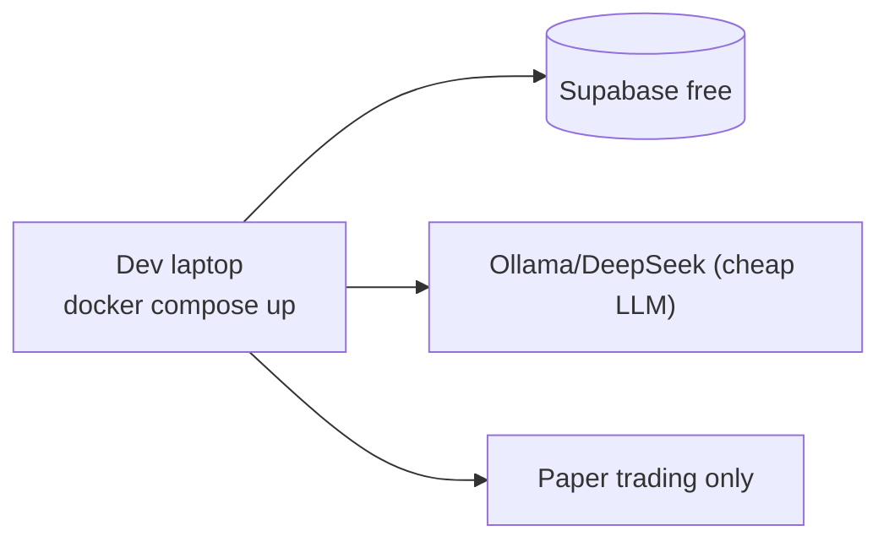

### 10.2 Testing / Staging

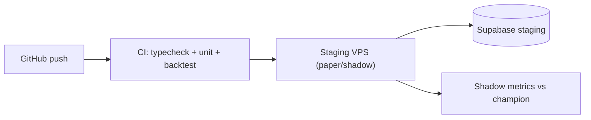

### 10.3 Production

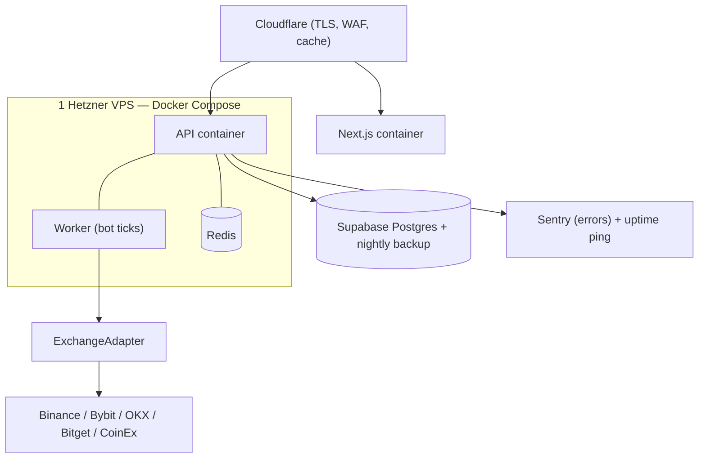

### 10.4 Enterprise scale

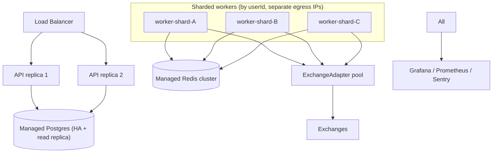

> **Split the worker out of the API process in production** (`npm run worker`) so a slow HTTP request never delays a trade tick. The per-user Redis lock already makes multiple workers safe.

---

## 11. Backtesting Framework

> **No model or rule change reaches live money without passing this gauntlet.**

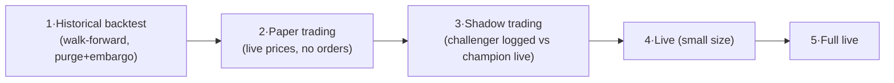

| Stage | What | **Promotion criteria → next stage** |
|---|---|---|
| **1 · Historical** | walk-forward CV with fees+funding+slippage; bull/bear/chop windows | Sharpe & profit-factor beat baseline **out-of-sample**; max-DD within limit |
| **2 · Paper** | run on live data, simulated fills (exists!) | ≥ N trades, win-rate/PF ≥ baseline over ≥30 days |
| **3 · Shadow** | challenger predicts alongside live champion, **no orders** | challenger beats champion on realized-vs-predicted, by a margin |
| **4 · Live small** | real orders at **min size** | positive expectancy & DD within limit over M trades |
| **5 · Full live** | scale to normal size | sustained; instant rollback armed |

**Hard rules:** time-series CV only (never random k-fold), always model fees/funding/slippage/min-notional, validate across regimes, assume backtests are optimistic.

---

## 12. Security Framework

### 12.1 Current posture (good baseline)

✅ AES-256-GCM for API keys **and** Telegram tokens · ✅ argon2 password + refresh-token hashing · ✅ JWT access/refresh rotation · ✅ TOTP 2FA · ✅ Helmet + CORS + rate-limit · ✅ env validated at boot (fail-fast) · ✅ `canWithdraw` warned · ✅ one-account fingerprint · ✅ audit + admin logs.

### 12.2 Upgrades

| Area | Upgrade |
|---|---|
| **Exchange keys** | enforce **least privilege**: trade-only, **withdrawals disabled**; refuse/flag keys with withdraw. Encourage exchange **IP allow-listing** to the worker egress IP. |
| **Secrets** | move `API_KEY_ENC_KEY`/JWT secrets to a secrets manager (Doppler/Infisical/SOPS); document **key-rotation** runbook. |
| **DB** | enable **Supabase Row-Level Security** as defense-in-depth; least-priv DB role for the app; **encrypted nightly backups** + restore drills. |
| **Monitoring** | wire the optional **Sentry DSN**; add uptime + balance-drift + "unexpected position" alerts. |
| **App** | dependency scanning (Dependabot), secret scanning, 2FA enforced for ADMIN, signed audit trail for money actions. |
| **Network** | Cloudflare WAF + rate-limit in front; per-tenant egress segregation at scale. |
| **Supply chain** | pin deps, review the small dep set (already lean — a plus). |

---

## 13. Implementation Roadmap

```mermaid
gantt
  dateFormat X
  axisFormat %s
  section Foundation
  P0 Data + Feature store + Risk skeleton      :0, 2
  section Capital preservation
  P1 Institutional Risk Manager (drawdown/exposure/vol-sizing) :2, 4
  section Conviction
  P2 ML model shadow→gate (LightGBM/ONNX)      :4, 7
  section Awareness
  P3 Cheap shared LLM sentiment/event-risk     :7, 9
  section Growth
  P4 Multi-exchange adapter (Bybit/OKX/Bitget/CoinEx) :9, 13
  section Self-improvement
  P5 Auto-train loop (gated champion/challenger):13, 16
  section Infra
  P6 VPS migration + worker split + monitoring :2, 6
```

| Phase | Goal | Outcome |
|---|---|---|
| **P0** | Feature store + risk skeleton + fix shared-IP/worker-split | able to train later; safer ops |
| **P1** 🥇 | **Institutional Risk Manager** | **drawdowns capped — capital preserved** |
| **P2** 🥈 | ML conviction (shadow→gate) | **fewer losing trades** |
| **P3** | Shared LLM sentiment/event guard | **avoid black-swan entries** |
| **P4** | Multi-exchange adapter | **growth: Bybit/OKX/Bitget/CoinEx** |
| **P5** | Gated auto-train | **self-improving, safely** |
| **P6** | VPS + monitoring | **cheaper + more reliable** |

---

## 14. Phase-by-Phase Checklist

**P0 — Foundation**
- [ ] `FeatureSnapshot` table + log full feature vector every evaluation (leak-free)
- [ ] Labeling job (forward returns + realized R)
- [ ] `RiskEvent` table (every veto/breaker logged)
- [ ] Split worker into its own process (`npm run worker`); make Redis required in prod
- [ ] Backtest harness scaffold (walk-forward + fees/funding/slippage)

**P1 — Risk Manager 🥇**
- [ ] Equity high-water-mark + drawdown kill-switch
- [ ] Daily/weekly/monthly loss limits
- [ ] Gross + per-asset + correlation exposure caps
- [ ] ATR-based SL + risk-%-of-equity, volatility-targeted sizing
- [ ] Volatility / news / black-swan / data-stale circuit breakers
- [ ] Dashboard "Risk" panel (limits, usage, breaker status)

**P2 — ML conviction 🥈**
- [ ] Train LightGBM `P(win)` on the feature store (walk-forward)
- [ ] Export ONNX → `ml.service.ts` in-process inference
- [ ] **Shadow** mode (log only) → validate → **gate** mode (`pWin ≥ τ`)
- [ ] Calibration + drift monitor; auto-fallback to rules

**P3 — Sentiment**
- [ ] Shared, cached sentiment service (DeepSeek/Gemini-Flash), strict JSON
- [ ] `eventRisk: high` → block new entries on that asset
- [ ] Monthly $ cap + graceful fallback

**P4 — Multi-exchange**
- [ ] `ExchangeAdapter` interface (balance, positions, klines, order, stop, filters)
- [ ] Binance adapter (wrap existing) → Bybit → OKX → Bitget → CoinEx
- [ ] Per-exchange rate-limit breaker + symbol-filter normalization
- [ ] Per-exchange paper validation before live

**P5 — Auto-train**
- [ ] Weekly retrain + champion/challenger + model registry + rollback
- [ ] Promotion gates (OOS + paper) ± human approve for live

**P6 — Infra/Sec**
- [ ] Hetzner VPS + Docker Compose + Caddy/Cloudflare
- [ ] Sentry + uptime + balance-drift alerts
- [ ] RLS, secret manager, key-rotation runbook, nightly backups + restore test

---

## 15. Final Recommended Architecture

**One sentence:** *A deterministic rule+ML signal engine, gated by an institutional risk manager, executing through a multi-exchange adapter, fed by a cheap shared LLM sentiment service, on one VPS + Supabase — with a gated offline auto-train loop.*

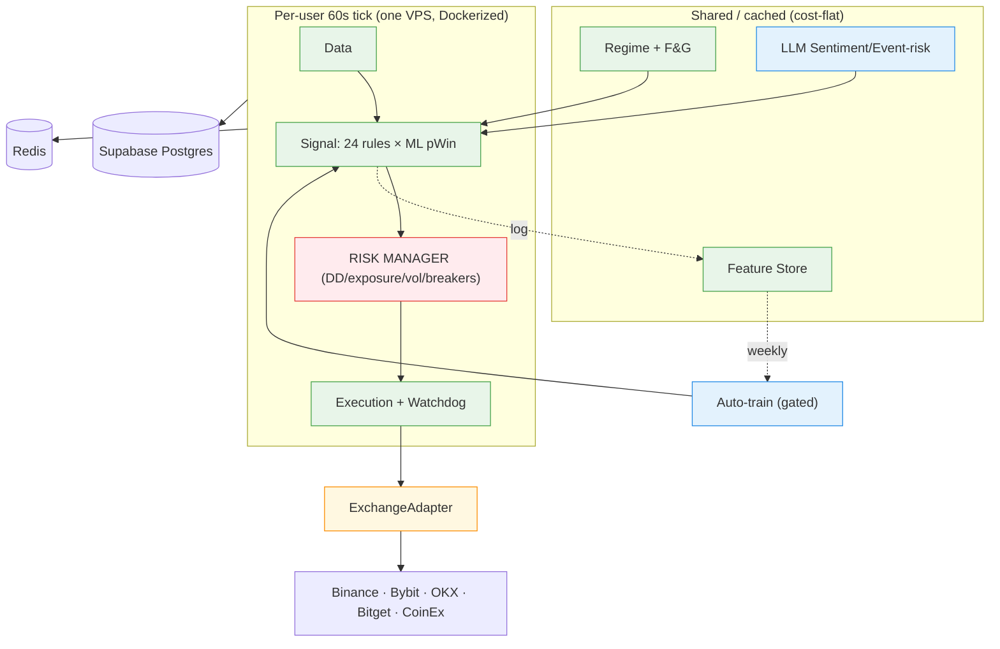

---

## 16. Final Recommended Model Stack

| Use | Pick | Why |
|---|---|---|
| **Development (build the app)** | **Claude (Opus/Sonnet)**; fallback **DeepSeek/Qwen-local** | best agentic coding; cheap fallback |
| **Product LLM — sentiment/news** | **DeepSeek** or **Gemini Flash** (shared+cached) | cents/day, good enough for text→features |
| **Real-time social spikes (optional)** | **Grok** | native X/real-time access |
| **Trading "model" (conviction)** | **LightGBM/XGBoost → ONNX** | right tool for tabular prediction; ~$0 to serve |
| **Online/incremental (later)** | **River** | streaming updates, same gates |

> ❌ Never let any LLM size or place a trade. ✅ ML predicts; LLM reads text; rules + risk decide.

---

## 17. Final Recommended Agent Stack

| # | Agent (service) | Type | Required? |
|---|---|---|---|
| 1 | Market Data | deterministic | ✅ |
| 2 | Signal (rules + ML) | deterministic | ✅ |
| 3 | **Risk Manager** | deterministic | ✅ **(new, top priority)** |
| 4 | Execution + Monitoring | deterministic | ✅ (merge) |
| 5 | Sentiment / Event-risk | **LLM (cheap, shared, cached)** | ⭐ recommended |
| 6 | Auto-train | offline batch job | ⭐ later |
| — | Macro / Portfolio / Validator | ❌ **merged away** | removed |

**5 live services + 1 offline job. No LLM swarm.**

---

## 18. Final Cost Breakdown

> Deterministic core = CPU-light; LLM = **shared** → flat. Cost scales **sub-linearly** with users.

| Users | Compute (VPS) | DB | Redis | LLM sentiment (shared) | **Total / mo** |
|---|---|---|---|---|---|
| **1** | $0–5 (local/tiny) | Supabase free | on-box | ~$0–1 | **~$0–6** |
| **10** | Hetzner CX22 ~$6 | Supabase free/$ | on-box | ~$1–2 | **~$7–10** |
| **100** | Hetzner CX32 ~$13 | Supabase Pro ~$25 | on-box | ~$2–4 (still shared) | **~$40–45** |
| **1000** | 2–3 workers + LB ~$60 | Managed PG ~$50–100 | managed ~$15 | ~$5–10 (shared) | **~$130–185** |

**Key insight:** going from 100→1000 users does **not** 10× the cost — the expensive parts (LLM, regime, news) are computed **once and shared**; only compute/DB grow, and roughly linearly with a flat shared overhead.

---

## 19. Expected Benefits

| Dimension | Current | After this plan (realistic target) |
|---|---|---|
| **Max drawdown** | unbounded at portfolio level | **hard-capped** by kill-switch (e.g. ≤15%) |
| **Losing trades** | rules-only | **fewer** (ML veto filters low-edge) |
| **Risk per trade** | fixed $ (inconsistent) | **constant % of equity, vol-aware** |
| **Win rate / PF** | baseline | **modest, durable lift** (selection + sizing) |
| **Risk-adjusted return (Sharpe)** | baseline | **higher** (steadier vol, smaller DD) |
| **Black-swan exposure** | unguarded | **event/news + black-swan breakers** |
| **Exchanges** | Binance only | **5 + future** |
| **Infra cost** | grows on PaaS | **~70% lower, flat to ~100 users** |
| **Explainability** | already good | **preserved** (every veto logged) |

> 📏 **Measure honestly:** always compare ML-on vs **rules-only baseline**, out-of-sample/paper. If it can't beat free, don't ship it.

---

## 20. Priority Actions

**Do these first (highest impact / lowest risk):**

1. 🥇 **Build the Risk Manager** (P1) — drawdown kill-switch, loss limits, exposure/correlation caps, **volatility-scaled risk-%-of-equity sizing**, circuit breakers. *This protects capital more than anything else.*
2. 🛠️ **Start logging the Feature Store** (P0) now — you can't train ML until you have ~30–60 days of leak-free data, so begin **today**.
3. 🧩 **Abstract the `ExchangeAdapter`** (P4 prep) — wrap the existing Binance client behind an interface so multi-exchange becomes additive.
4. 🖥️ **Split the worker out + make Redis required in prod; plan the VPS migration** (P6) — cheaper, more reliable, no tick starvation.
5. 🧠 **Stand up the ML conviction model in shadow mode** (P2) — measure before you trust it.
6. 📰 **Add the cheap shared sentiment/event-risk guard** (P3) — avoid trading into hacks/depegs.
7. 🔐 **Security hardening** (P6) — withdraw-disabled keys, exchange IP allow-list, secrets manager, Sentry, backups + restore drill.

**Do NOT do:** chase more trades, raise leverage, build a multi-LLM swarm, let an LLM place orders, or migrate to Kubernetes/AWS before 1k+ users.

---

### 🧭 One-paragraph north star

> Keep the deterministic rule engine as the spine. Put an **institutional risk manager** in charge of *capital* (drawdown, exposure, volatility-scaled sizing) — that's where "capital preservation first" is won. Add an **ML conviction filter** to cut bad trades, and a **cheap, shared LLM** only to read news/sentiment into features (never to trade). Run it all on **one cheap VPS + Supabase**, behind a clean **multi-exchange adapter**, with every change earning its way to live through **paper → shadow → small-live**. Fewer, better, safer, cheaper — *that* is the world-class retail crypto agent.

---

*This is a design document. No code has been changed. See [`07-ai-ml-llm-roadmap.md`](./07-ai-ml-llm-roadmap.md) and [`08-how-the-bot-works-today.md`](./08-how-the-bot-works-today.md) for the ML detail and the current-system reference.*
