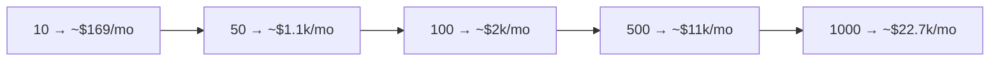

# 📊 FINANCIAL PROJECTION — MASTER PLAN

**Illustrative unit economics from 10 → 1000 paying customers.**

> ⚠️ **Illustrative, not a forecast or guarantee.** Real results depend on plan mix, conversion, churn, and pricing — all unproven pre-launch. Figures in **USD** (≈ ₹85/$). Validate with your CA.
>
> See also: [Monetization](./SAAS_MONETIZATION_MASTER_PLAN.md) · [Founder](./FOUNDER_MASTER_PLAN.md) · [Trading §18 costs](./FINAL_TRADING_AGENT_MASTER_PLAN.md).

---

## Executive Summary

- This is a **high-margin SaaS (~80–90% gross margin)** because the expensive parts (infra, AI/regime, sentiment) are **shared/flat** and grow **sub-linearly** with users.
- **Break-even is early:** ~**10–20 paying customers** covers all monthly running + amortized compliance cost. The business is clearly profitable by **~50 paying customers**.
- The **constraint is growth (conversion/churn), not cost.** Spend energy on the funnel (free paper → paid) and retention, not on infra.

**Assumptions:** blended **ARPU ≈ $25/mo** (mix of Free $0 / Starter $15 / Pro $39 / Team $99); payment fees ~4%; founder unpaid until a support hire at ~100 users; compliance amortized post-incorporation.

---

## Monthly P&L by scale (USD)

| Paying customers | Revenue | Payment fees (~4%) | Infra | AI (shared) | Support | Compliance (amort.) | **Est. profit/mo** | Margin |
|---:|---:|---:|---:|---:|---:|---:|---:|---:|
| **10** | $250 | $10 | $10 | $1 | $0 (you) | $60 | **~$169** | ~68% |
| **50** | $1,250 | $50 | $12 | $2 | $0 (you) | $60 | **~$1,126** | ~90% |
| **100** | $2,500 | $100 | $40 | $4 | $250 (VA) | $60 | **~$2,046** | ~82% |
| **500** | $12,500 | $500 | $90 | $8 | $500 | $100 | **~$11,302** | ~90% |
| **1000** | $25,000 | $1,000 | $160 | $12 | $1,000 | $150 | **~$22,678** | ~91% |

> Infra/AI scale **sub-linearly** (shared cache/model) — 100→1000 users is ~4× cost for ~10× revenue. That's the whole point of the architecture.

---

## Annualized snapshot

| Paying | ARR (gross) | Est. annual profit |
|---:|---:|---:|
| 50 | ~$15k | ~$13.5k |
| 100 | ~$30k | ~$24.5k |
| 500 | ~$150k | ~$135k |
| 1000 | ~$300k | ~$270k |

(Before founder salary/tax; pre-funding. India corporate tax ~22% applies on profit — and **DPIIT 80-IAC** may give a 3-year holiday; confirm with CA.)

---

## One-time + early costs (reality check)

| Item | Cost |
|---|---|
| Incorporation (Pvt Ltd) | ₹15–35k one-time |
| Legal docs + lawyer review | ₹30k–1.5L |
| Launch marketing | ₹20–80k |
| **Annual compliance (CA + audit)** | ₹40–80k/yr |

→ At **10 paying customers (~$250/mo ≈ ₹21k/mo)** you cover monthly running + amortized compliance with a small surplus; one-time formation costs are recovered within the first months of paid revenue.

---

## Sensitivity (what actually moves the needle)

| Lever | Effect |
|---|---|
| **Conversion** (free paper → paid) | linear on revenue — the #1 lever |
| **Churn** (keep < 5–8%/mo) | compounds hugely on ARR |
| **ARPU** (plan mix / higher Pro adoption) | linear; a real-money tool can sustain higher prices |
| **Payment fees / reserve** | 4% → 5%+ if high-risk classification; model it |
| Infra/AI | barely matters (flat) |

## Risks

- **Optimistic ARPU/conversion** — these are unproven; treat as hypotheses to test in beta.
- **Higher payment fees + rolling reserve** for "high-risk" crypto businesses → model 5% + reserve.
- **Refunds/chargebacks** reduce net → clear policy.
- **Compliance/tax** under-budgeted → CA retainer is fixed, plan for it.

## Alternatives

- Higher-priced, lower-volume (fewer Pro/Team customers at higher ARPU) — often easier than chasing thousands of $15 users.
- Annual-plan push for cash-flow + lower churn.

## Step-by-Step Actions

1. Instrument **conversion + churn + ARPU** from day one of paid.
2. Re-run this model with **real** numbers after 50 paying customers.
3. Optimize the **funnel + retention** before spending on growth.
4. Keep infra/Ai shared (don't let per-user cost creep in).

## Timeline

First real data after **first 50 paying customers** (Phase 5–6); revisit quarterly.

## Priority Checklist

- [ ] Track conversion / churn / ARPU.
- [ ] Model payment fees at 5% + possible reserve.
- [ ] Keep infra/AI shared (sub-linear).
- [ ] Re-forecast with real data at 50 customers.
- [ ] Confirm tax (22% / 80-IAC holiday) with CA.
