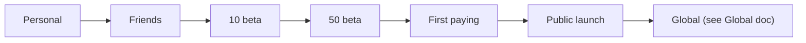

# 🚀 GO-TO-MARKET — MASTER PLAN

**From "just me using it" to public launch — phase by phase.**

> ⚠️ Marketing copy is a **legal surface** for a trading product — no profit/guarantee claims, ever ([Legal doc](./LEGAL_AND_COMPLIANCE_MASTER_PLAN.md)).
>
> See also: [Founder](./FOUNDER_MASTER_PLAN.md) · [Monetization](./SAAS_MONETIZATION_MASTER_PLAN.md) · [Ops](./BUSINESS_OPERATIONS_MASTER_PLAN.md).

---

## Executive Summary

- **Sell trust, not hype.** For a real-money crypto tool, the winning message is **"capital preservation, you stay in control, non-custodial, transparent"** — not "get rich." This both converts skeptical crypto users *and* keeps you legal.
- **Paper-first is your best sales tool:** let prospects watch the bot work risk-free. The free paper tier *is* the funnel.
- Go slow and safe: **personal → friends → small beta → bigger beta → first paying → public.** Each stage de-risks the next.
- Cheapest effective channels for this niche: **content/SEO ("how to avoid blowing up your futures account"), crypto communities (Reddit/Discord/Telegram/X), ProductHunt, and referrals** — not paid ads early (crypto ad policies are restrictive anyway).

---

## Phases

| Phase | Audience | Goal | Key metric | Success criteria | Top risk |
|---|---|---|---|---|---|
| **1 · Personal** | you | prove it's safe with real money | uptime, no SL-gaps, P&L sanity | 30+ days stable on your own tiny live a/c | a real-money bug → keep size tiny |
| **2 · Friends & family** | 3–5 trusted | usability + setup friction | onboarding completion | they connect + run paper unaided | bad UX → fix before strangers |
| **3 · 10 beta** | invited | value + feedback | activation (paper trades run), retention wk-1 | 7/10 active, 3 testimonials | someone loses money → paper-first + risk consent |
| **4 · 50 beta** | waitlist | scale test + word-of-mouth | WAU, NPS, support load | 50 users, NPS > 30, support manageable | support overwhelm → KB/FAQ first |
| **5 · First paying** | beta → paid | willingness to pay | conversion %, MRR, churn | 5–10 paying, MRR > running cost | churn → onboarding + value clarity |
| **6 · Public launch** | open | growth | signups, CAC, paid conversion | 50–100 customers, churn < 8%/mo | a public claim violation → copy review |

---

## Messaging framework

| Pillar | Say | Don't say |
|---|---|---|
| Safety | "capital-preservation-first; hard risk limits; non-custodial — your funds never leave your exchange" | "safe profits", "no risk" |
| Control | "your keys, your account, your rules; full transparency on every decision" | "we trade for you" |
| Intelligence | "rule + ML conviction; cheap; explainable" | "AI that beats the market" |
| Honesty | "trading is risky; only trade what you can lose; paper-first" | "guaranteed", "passive income" |

## Channels (cheap → paid)

1. **Content/SEO** — risk-management & automation education (evergreen, free).
2. **Communities** — crypto Discord/Telegram/Reddit/X; be helpful, not spammy.
3. **ProductHunt / Indie Hackers / HN** — launch moment.
4. **Referral program** (coupon engine already supports codes).
5. **Comparison/landing pages** (pricing, features, FAQ, security/trust).
6. Paid ads **later** (crypto ad approval is hard; tread carefully + compliant copy).

## Cost Estimates

- Phases 1–4: **~₹0** (organic + your time).
- Phase 5–6: **₹20–80k** (content, ProductHunt assets, small experiments).

## Risks

- **Claims violation** in a post/ad → strict pre-publish review checklist.
- **Over-promising in demos** (showing big paper gains) → always disclaim "simulated; fees/slippage differ".
- **Scaling support** before systems → KB/FAQ + ticketing first ([Ops doc](./BUSINESS_OPERATIONS_MASTER_PLAN.md)).
- Crypto **ad-platform rejections** → lean organic.

## Alternatives

- Niche down (e.g., "for Binance futures users who keep getting liquidated") for sharper messaging.
- Partner with a crypto educator/community for distribution (revenue share via coupons).

## Step-by-Step Actions

1. Build a **trust-first landing** (security, non-custodial, honest risk) + waitlist.
2. Run Phases 1–4 organically; collect testimonials + fix friction.
3. Launch **Free paper tier** publicly as the funnel.
4. Convert beta → paid (founding-member pricing).
5. ProductHunt + community launch (Phase 6).
6. Add referral; measure CAC/LTV; only then consider paid.

## Timeline

Phases 1–4 over **weeks 4–20**; first paying **wk 22–30**; public launch **mo 7–10**.

## Priority Checklist

- [ ] Trust-first messaging locked (no profit claims).
- [ ] Free paper tier = funnel.
- [ ] Testimonials from beta.
- [ ] Pricing + founding-member offer.
- [ ] Pre-publish claim-review checklist.
- [ ] Referral program live for public launch.
