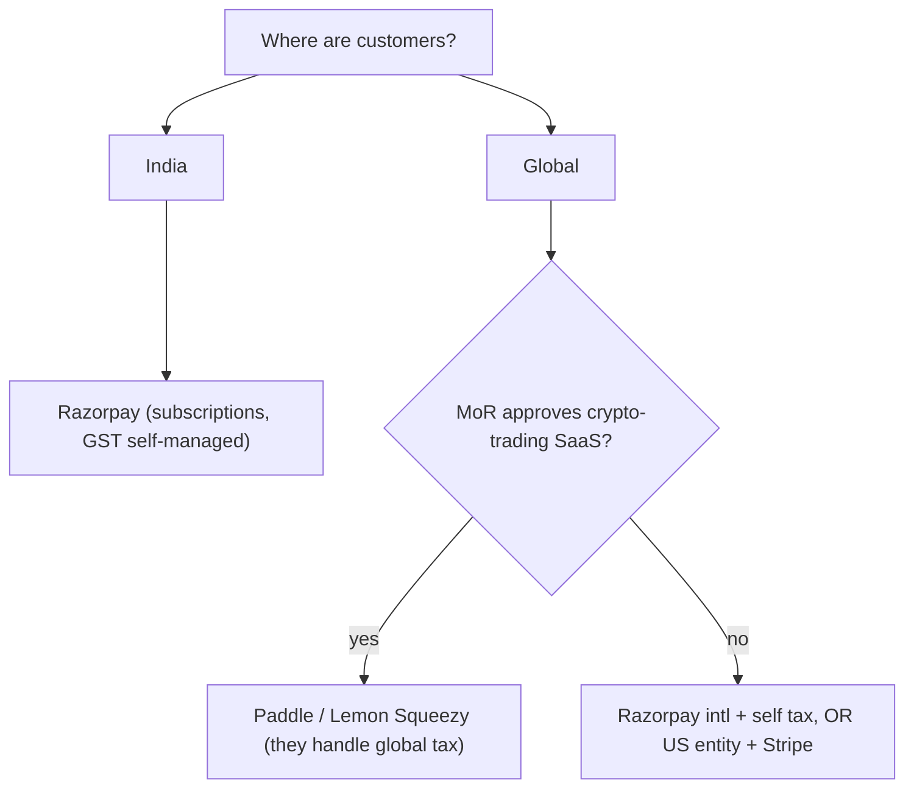
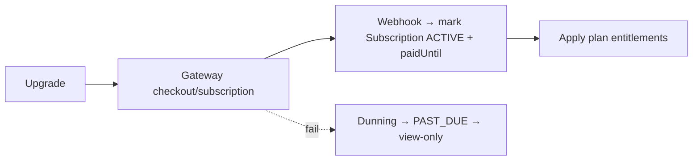

# 💳 PAYMENT GATEWAY — MASTER PLAN

**How to actually collect money — India + global — for a crypto-trading SaaS.**

> 🚨 **THE single biggest commercial risk in this whole plan:** most major processors **restrict or prohibit** "crypto", "trading bots", "financial trading software", and "get-rich/profit" products. **Confirm acceptance in writing BEFORE you build billing or rely on a provider.** This can block your business model. (NOT legal/financial advice.)
>
> See also: [Founder](./FOUNDER_MASTER_PLAN.md) · [Monetization](./SAAS_MONETIZATION_MASTER_PLAN.md) · [Tax](./TAX_AND_ACCOUNTING_MASTER_PLAN.md) · [Legal](./LEGAL_AND_COMPLIANCE_MASTER_PLAN.md).

---

## Executive Summary

- **Positioning is everything for approval:** present as **non-custodial software/SaaS subscriptions** (you sell a *tool*; you never hold crypto, trade for users, or promise returns). Don't describe yourself as a crypto exchange, broker, fund, or "trading signals/advice."
- **India customers → Razorpay** (best DX + subscriptions). **Cashfree** as backup. Both will **underwrite** a crypto-adjacent business — apply early, be precise about "software".
- **Global customers → Merchant of Record (MoR)** is ideal for a solo founder *because it handles worldwide sales-tax/VAT for you* — **BUT Paddle/Lemon Squeezy/Stripe frequently reject crypto-trading software.** So global may force you to a self-managed gateway + your own tax handling, or careful MoR approval.
- **Pragmatic recommendation:** **Razorpay (India + intl cards)** for launch; pursue **Paddle/Lemon Squeezy** for global *only after written approval*; consider a **US entity + Stripe** only if global-first justifies the added compliance.

---

## 1. India gateways

| | **Razorpay** | **Cashfree** | **PayU** |
|---|---|---|---|
| Setup difficulty | easy, great docs | easy | medium |
| Subscriptions | ✅ Razorpay Subscriptions | ✅ | ✅ |
| Intl cards | ✅ (with approval) | ✅ | ✅ |
| Compliance/KYC | standard; crypto = extra underwriting | similar | similar |
| Tax handling | you handle GST | you handle GST | you handle GST |
| Payouts/FIRA | ✅ supports export docs | ✅ | ✅ |
| DX / fit | 🏆 best | strong | enterprise-ish |

→ **Razorpay** for India launch (DX + subscriptions + intl). Have your CA confirm GST invoicing through it.

## 2. Global gateways

| | **Stripe** | **Paddle** (MoR) | **Lemon Squeezy** (MoR) |
|---|---|---|---|
| Setup | easy *(needs US/UK/supported entity)* | easy | very easy |
| **Handles global tax (VAT/sales tax)?** | ❌ you handle | ✅ **MoR handles it** | ✅ **MoR handles it** |
| Subscriptions | ✅ best-in-class | ✅ | ✅ |
| Intl support | excellent | excellent | excellent |
| **Crypto-trading acceptance** | ⚠️ **restricted** | ⚠️ **often prohibited** | ⚠️ **often prohibited** |
| India entity direct use | limited | as customer-of-record | as customer-of-record |

→ **MoR = huge solo-founder advantage** (no need to register for tax in every country) — *if* they accept you. **They frequently don't for trading software.** Confirm first.

---

## 3. Integration with the existing billing engine

The platform already has periods, invoices, coupons, and a stubbed `provider*` field set. Integration = thin:

| Build item | Effort |
|---|---|
| Checkout/subscription create | small |
| **Webhook** → activate/expire (the missing piece) | small |
| Dunning (retry → PAST_DUE) | small |
| Invoice/GST fields + PDF | small |

## Cost Estimates

- Fees: **India ~2–3%**, **intl cards ~3–4%**, **MoR ~5% + $0.50** (they earn it by handling tax/compliance).
- Possible **rolling reserve** (5–10% held 90–180d) for "high-risk" categories — plan cash flow for it.
- Build cost ≈ ₹0 (you have Claude Code + an existing billing engine).

## Risks

- 🔴 **Account rejection / sudden termination** for crypto-trading → **diversify: at least 2 approved providers**; keep positioning clean; never use profit claims.
- Chargebacks/fraud → strong KYC, clear refunds, 3DS.
- Holding a reserve hurts early cash flow.
- Using a provider that later bans you mid-growth = existential → get written acceptance + a backup.

## Alternatives

- **Crypto-native payments** (accept USDT/stablecoin via a crypto payment processor) — fits the audience, sidesteps card-network crypto bans, but adds its own KYC/AML + accounting + volatility handling. Consider as a *secondary* option.
- **US Delaware C-Corp (Stripe Atlas) + Stripe** if truly global-first — but verify Stripe accepts the use-case (trading software is restricted) and accept US compliance overhead.

## Step-by-Step Actions

1. **Phase 0:** email Razorpay + Cashfree + Paddle/Lemon Squeezy describing the product honestly as **non-custodial trading-automation software** → get acceptance in writing.
2. Integrate **Razorpay subscriptions + webhook** first.
3. Add **dunning** + invoice/GST.
4. Add a **second** provider for redundancy.
5. Pursue MoR for global once approved; else self-manage tax ([Tax doc](./TAX_AND_ACCOUNTING_MASTER_PLAN.md)).

## Timeline

Approval + Razorpay integration: **Phase 4** (~1–2 weeks once incorporated).

## Priority Checklist

- [ ] **Confirm acceptance in writing FIRST** (Phase 0).
- [ ] Razorpay subscriptions + webhook + dunning.
- [ ] Second provider for redundancy.
- [ ] MoR for global *only if approved*.
- [ ] Never use profit/guarantee language in checkout or product.
