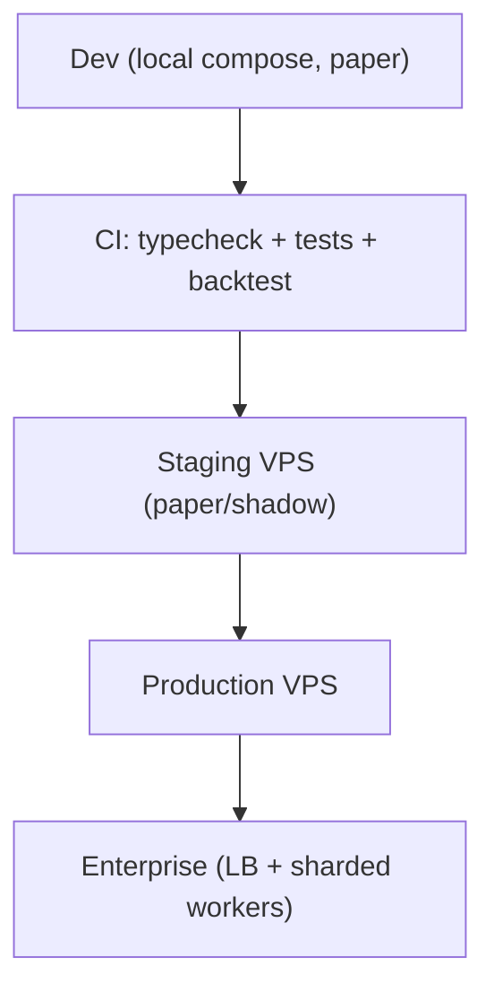
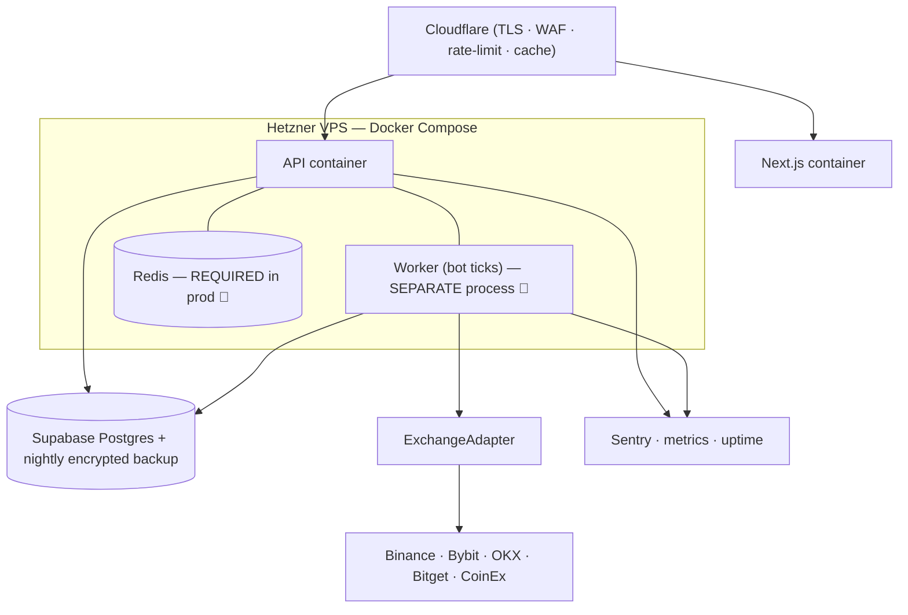
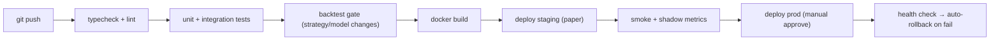
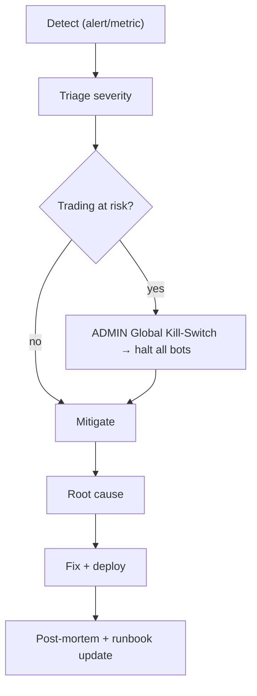

# 🚢 PRODUCTION & DEPLOYMENT — MASTER PLAN

**Environments, CI/CD, observability, security, scaling, and incident response for a real-money SaaS.**

> **Doc set:** [Trading agent](./FINAL_TRADING_AGENT_MASTER_PLAN.md) · [Product](./PRODUCT_ARCHITECTURE_MASTER_PLAN.md) · [User journey](./USER_JOURNEY_MASTER_PLAN.md) · [Admin](./ADMIN_PORTAL_MASTER_PLAN.md) · [SaaS](./SAAS_PLATFORM_MASTER_PLAN.md) · **Deploy (this)**.
> **Legend:** ✅ Have · ⚠️ Partial · ❌ Missing · 🎯 Target.

---

## 1. Current state (grounded)

- **Hosting:** Railway (2 Docker services: API, frontend). **DB:** Supabase Postgres. **Redis:** optional (in-memory shim fallback ⚠️).
- **Build:** Dockerfiles per service; root build context. Auto-deploy from GitHub (historically **flaky** — fall back to forced deploy by commit SHA).
- **Health:** `/healthz` (liveness), `/readyz` (DB check) ✅. Diagnostics endpoint (egress IP + exchange reachability) ✅.
- **Logging:** `pino` structured + `pino-http` ✅. **Sentry:** DSN supported but optional ⚠️.
- **Workers:** bot ticks can run in-process or as a separate `npm run worker` ⚠️ (recommend split in prod).
- **Config:** env validated at boot (fail-fast) ✅; secrets in env.

**Verdict:** solid for a small launch. For scale + reliability: **move prod to a VPS**, **split the worker**, **make Redis required**, and add **metrics/alerting/runbooks**.

---

## 2. Environments

| Env | Purpose | Stack | Cost |
|---|---|---|---|
| **Development** | local dev | Docker Compose + Supabase free + paper + cheap LLM | ~$0–5 |
| **Testing/Staging** | CI + paper/shadow validation | 1 small VPS or Railway hobby; separate Supabase | ~$5–8 |
| **Production** | live users | 1 Hetzner VPS (API+worker+Redis via Compose) + Supabase + Cloudflare | ~$8–15 |
| **Enterprise** | 1k+ users | LB + API replicas + sharded workers (separate egress IPs) + managed PG/Redis | scales linearly |

### 2.1 Production topology (recommended)

> **Two must-fix for prod:** (1) **split the worker** out of the API so a slow request never delays a trade tick (per-user Redis lock already makes this safe); (2) **require Redis** (no in-memory shim) so locks/pubsub work across restarts/replicas.

---

## 3. CI/CD 🎯

- **Gates:** typecheck (✅ already clean), tests, and a **backtest gate** for any strategy/model change ([trading plan §11](./FINAL_TRADING_AGENT_MASTER_PLAN.md)).
- **DB migrations:** `prisma migrate deploy` in the pipeline; for schema changes on Supabase, `prisma db push` **before** code deploy (a known gotcha).
- **Rollback:** keep previous image; health-check after deploy → auto-rollback. Deploy by **explicit commit SHA** (Railway webhook has been flaky).

---

## 4. Observability

| Pillar | Today | Target 🎯 |
|---|---|---|
| **Logging** | pino structured ✅ | ship to Loki/Better Stack; redact secrets; per-tenant correlation id |
| **Metrics** | ❌ | Prometheus/OpenTelemetry: tick latency, trades/min, error rate, queue/lock contention, exchange latency, LLM $/calls |
| **Tracing** | ❌ | OTel spans across API→engine→exchange for slow-path debugging |
| **Alerting** | ❌ | PagerDuty/Telegram/email on: bot tick stalled, exchange ban, DB down, error spike, **balance drift**, payment-webhook fail |
| **Uptime** | ⚠️ healthz | external uptime ping on `/readyz` + frontend |
| **Error tracking** | ⚠️ Sentry optional | **wire Sentry** (DSN already supported) front + back |
| **Dashboards** | ❌ | Grafana: system + business (MRR, active bots, P&L aggregate) |

### 4.1 Trading-specific alerts (critical) 🎯
- **Bot tick stalled** (no sweep in >2 min) → page.
- **Exchange ban / key invalid** → auto-pause affected users + alert.
- **Balance drift** (DB vs exchange mismatch) → alert (possible bug/incident).
- **Drawdown kill-switch fired** → notify operator.
- **Global halt active** → banner everywhere.

---

## 5. Security (ops)

(Full app-security in [Trading plan §12](./FINAL_TRADING_AGENT_MASTER_PLAN.md).) Ops layer:

| Area | Target |
|---|---|
| Secrets | move `API_KEY_ENC_KEY`/JWT to a secrets manager (Doppler/Infisical/SOPS); **rotation runbook** |
| Exchange keys | enforce trade-only, **withdrawals OFF**; exchange **IP allow-list** to worker egress IP |
| DB | Supabase **RLS** as defense-in-depth; least-priv app role; **encrypted nightly backups + monthly restore drill** |
| Network | Cloudflare WAF + rate-limit; per-tenant egress segregation at scale (one ban ≠ everyone frozen) |
| Supply chain | Dependabot, secret scanning, pinned deps (dep set is already lean ✅) |
| Access | 2FA enforced for staff/ADMIN; signed audit trail for money actions (✅ `AdminLog`) |
| Data | GDPR export/delete (delete-user exists ✅; add self-serve export) |

---

## 6. Scaling path

| Users | Move |
|---|---|
| 1–100 | one VPS (API+worker+Redis) + Supabase. Done. |
| 100–1k | split worker to its own box; managed Postgres; managed Redis |
| 1k–10k | **shard workers by `userId`** across N nodes (per-user lock already idempotent); **separate egress IPs** per shard; read-replica DB; LB + API replicas |
| 10k+ | ticks → job queue (BullMQ/Redis); autoscale workers; regional egress; HA Postgres |

> The per-user Redis lock + shared market cache already make horizontal sharding straightforward — the architecture was built for this.

---

## 7. Backups & DR 🎯

- **Postgres:** nightly encrypted backup (Supabase PITR or `pg_dump` to object storage); **monthly restore drill**.
- **Secrets:** backed up in the secrets manager; `API_KEY_ENC_KEY` loss = all exchange keys unrecoverable → **escrow carefully**.
- **RPO/RTO targets:** RPO ≤ 24h (≤ 1h with PITR), RTO ≤ 1h.
- **Config-as-code:** Docker Compose + env templates in repo (no secrets) → rebuild prod in minutes.

---

## 8. Incident response 🎯

| Severity | Example | Action |
|---|---|---|
| **SEV-1** | wrong orders / balance drift / exchange-wide outage | **global kill-switch**, page, flatten if needed |
| **SEV-2** | one exchange banned / worker stalled | auto-pause affected, page on-call |
| **SEV-3** | API errors elevated, UI degraded | mitigate, fix next deploy |
| **SEV-4** | cosmetic | backlog |

**Runbooks to write:** exchange ban recovery · key-rotation · DB restore · stuck-tick · payment-webhook replay · global-halt + resume.

---

## 9. Priority actions (deploy/ops)

1. 🥇 **Split the worker + require Redis + wire Sentry** (reliability fundamentals).
2. 🥈 **Migrate prod to a Hetzner VPS** (Docker Compose + Cloudflare) — cheaper, more control.
3. 🥉 **Trading-critical alerting** (tick-stall, exchange-ban, balance-drift, kill-switch) + uptime ping.
4. **Backups + monthly restore drill** + secrets manager + key-rotation runbook.
5. **CI/CD with backtest gate + auto-rollback**; deploy by explicit SHA.
6. **Metrics/Grafana** (system + business) when past ~100 users.

> **Principle:** in a real-money system, **observability and the kill-switch are not optional**. You must be able to *see* a problem and *stop everything* in seconds — before scale, before features.
