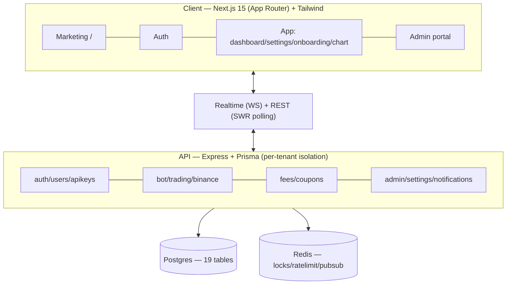
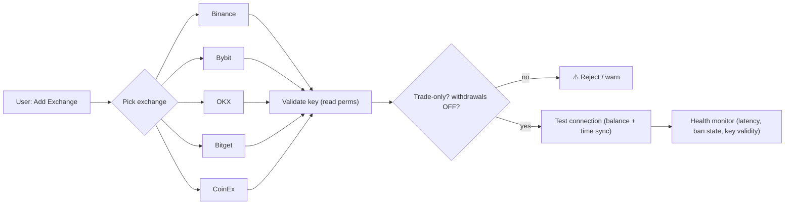

# 🧭 PRODUCT ARCHITECTURE — MASTER PLAN

**A Principal Product / SaaS / UX / FinTech architect review of the *whole* platform — not just the trading agent.**

> This is a **complete production SaaS**: landing, auth, dashboard, profile, charts, trading, analytics, admin portal, billing. This doc reviews the product surface and designs the ideal version.
>
> **Doc set:** [Trading agent](./FINAL_TRADING_AGENT_MASTER_PLAN.md) · **Product (this)** · [User journey](./USER_JOURNEY_MASTER_PLAN.md) · [Admin portal](./ADMIN_PORTAL_MASTER_PLAN.md) · [SaaS platform](./SAAS_PLATFORM_MASTER_PLAN.md) · [Production/deploy](./PRODUCTION_DEPLOYMENT_MASTER_PLAN.md).
>
> **Legend:** ✅ Have · ⚠️ Partial · ❌ Missing · 🎯 Target/Recommend.

---

## 1. Product surface — what exists today (grounded)

### 1.1 Frontend pages/routes

| Route | Purpose | Status |
|---|---|---|
| `/` (`app/page.tsx`) | Landing / marketing (single page, branding-driven) | ⚠️ minimal |
| `/login`, `/register` (`(auth)`) | Email/password auth | ✅ |
| `/onboarding` (`(app)`) | 4-step setup (connect → mode → activate) | ⚠️ shallow |
| `/dashboard` (`(app)`) | Main terminal (KPIs, signals, positions, analytics) | ✅ rich |
| `/settings` (`(app)`) | Profile (tabs: basic · setup · coupon · password) | ⚠️ thin |
| `/chart/[symbol]` (`(app)`) | Per-symbol AI plan / S-R / signal breakdown | ✅ |
| `/admin` (`(admin)`) | Staff CRM portal | ✅ broad |

### 1.2 Backend modules (API)

`auth` · `users` · `apikeys` · `binance` · `bot` · `trading` · `fees`(billing) · `admin` · `notifications` · `settings`(branding/public) · `coupons` · `health`.

### 1.3 Architecture layers



**Verdict:** the platform is **genuinely full-stack and commercial-grade in its bones** — clean module boundaries, multi-tenant isolation, RBAC (ADMIN/MANAGER/SUPPORT/TRADER), billing, audit/admin logs, a real admin portal. The gaps are **breadth of UX surface**, not foundational architecture. Build outward, don't rebuild.

---

## 2. Whole-product gap analysis

| Domain | Have | Missing / Target 🎯 |
|---|---|---|
| **Marketing** | single branded landing | ❌ pricing, features, docs, FAQ, contact, blog/changelog |
| **Auth** | email+pwd, TOTP 2FA, email-OTP, refresh rotation, sessions table | ❌ Google/GitHub OAuth, ❌ password reset, ❌ device-management UI, ⚠️ email-verify UX |
| **Onboarding** | 4 steps (connect→mode→activate) | 🎯 10-step guided flow w/ risk profile, paper-first, strategy pick ([journey doc](./USER_JOURNEY_MASTER_PLAN.md)) |
| **Dashboard** | KPIs, signals, positions, protection, analytics, AI cards | ⚠️ no Sharpe/sortino, weekly/monthly returns split, drawdown curve, open-orders view, agent-decision log |
| **Profile/Settings** | basic info, API setup, coupon, password | ❌ preferences, exchange mgr, full security, billing/subscription panel, notification prefs, data export |
| **Exchange mgmt** | Binance connect + validate (trade-only) | ❌ Bybit/OKX/Bitget/CoinEx, ❌ health monitor, ⚠️ multi-key UI |
| **Strategy mgmt** | one engine, toggles in settings | ❌ strategy catalog (view/enable/clone/backtest/compare) |
| **Risk UI** | mode preset + a few fields | ❌ user-facing daily/weekly/monthly loss, exposure, allowed/blacklist pairs, schedule |
| **Analytics** | dashboard cards + 7d perf | ❌ dedicated analytics pages (perf/risk/portfolio/strategy/trade/exchange) |
| **Notifications** | in-app, email, Telegram | ❌ Discord, push, SMS; ❌ preference center |
| **Admin** | users/bot/coupon/branding/broadcast | ❌ KYC review, ❌ global kill-switch, ⚠️ revenue/AI metrics ([admin doc](./ADMIN_PORTAL_MASTER_PLAN.md)) |
| **Mobile** | responsive web | ❌ PWA manifest, ❌ native wrappers |
| **Observability** | pino logs, /healthz, optional Sentry | ❌ metrics/tracing/alerting/runbooks ([deploy doc](./PRODUCTION_DEPLOYMENT_MASTER_PLAN.md)) |

---

## 3. Ideal User Dashboard

Keep the current rich terminal; reorganize into **clear tabs** so it scales without becoming a wall.

```
┌── Top bar: balance · equity · today P&L · bot status · mode · risk gauge ──┐
│  Tabs:  Overview │ Positions │ Analytics │ Strategies │ Risk │ Activity      │
└────────────────────────────────────────────────────────────────────────────┘
Overview   → Portfolio summary + Top Opportunity + Next Trade + Fear&Greed + Live Signals
Positions  → Active positions (live PnL) · Open orders · Protection · Trade history
Analytics  → Equity curve · drawdown · returns (D/W/M) · Sharpe/Sortino · win-rate · per-coin
Strategies → Strategy catalog: enable/disable/configure/paper/clone/backtest/compare
Risk       → Limits + live usage gauges + circuit-breaker status + allowed/blacklist pairs
Activity   → AI insights · agent decisions · alerts · notifications · audit log
```

### 3.1 Portfolio Overview metrics 🎯

| Metric | Source | Status |
|---|---|---|
| Equity / Balance / Available | account sync | ✅ |
| Daily / Weekly / Monthly return | `PnlHistory` aggregates | ⚠️ add W/M |
| Unrealized + Realized P&L | positions / trades | ✅ |
| **Max drawdown** + curve | equity high-water-mark | ❌ add |
| **Sharpe / Sortino** | daily returns series | ❌ add |
| Profit factor / win-rate / expectancy | `TradeHistory` | ⚠️ partial |

### 3.2 Activity feed 🎯
`AI Insights` (regime/strategy read) · `Agent Decisions` (every tick: scored / gated / opened, with the *why*) · `Alerts` (risk breaches) · `Notifications` (channel deliveries) · `Audit Log` (`AuditLog` table — already exists).

---

## 4. User Profile System (redesign)

Replace the 4-tab settings with a complete **account hub** (sidebar sections):

| Section | Contents | Status |
|---|---|---|
| **Profile** | name, avatar, country, timezone, KYC status | ⚠️ basic |
| **Preferences** | theme, default mode, locale, dashboard layout | ❌ |
| **Trading Config** | margin/leverage/SL/TP/scaled-TP/toggles/adaptive-learning | ⚠️ (lives in dashboard today) |
| **Exchange Management** | connected exchanges, add/remove key, health, permissions | ⚠️ Binance only |
| **Security** | password, 2FA (TOTP), **active sessions/devices**, login history | ⚠️ no device mgmt |
| **Billing** | invoices, payment method, usage meter | ⚠️ usage only |
| **Subscription** | current plan, upgrade/downgrade, coupon | ⚠️ partial |
| **Notifications** | per-channel + per-event toggles | ❌ |
| **API Settings** | personal API tokens (for power users / mobile) | ❌ |
| **Data Export** | trades CSV, tax report, full data (GDPR) | ❌ |

---

## 5. Exchange Management Module

Today: **Binance-only**, single key, validated trade-only. Target: multi-exchange behind one UX.



- **Connection validation** (✅ for Binance: validates against API, stores AES-256, fingerprints UID).
- **Permission validation** 🎯 enforce trade-only, **withdrawals disabled**; encourage exchange **IP allow-list**.
- **Test connection** 🎯 round-trip balance + server-time skew check, shown live.
- **Health monitoring** 🎯 per-exchange: key validity, rate-limit/ban state, latency, last-sync — a status chip per exchange.
- Backed by the `ExchangeAdapter` from the [trading plan §P4](./FINAL_TRADING_AGENT_MASTER_PLAN.md).

---

## 6. Strategy Management Module 🎯

Today there is **one** engine with toggles. Target: a **strategy catalog** so the platform is extensible and marketable.

| Action | Design |
|---|---|
| **View** | catalog cards: name, family (trend/mean-rev/breakout), regime fit, live stats |
| **Enable / Disable** | per-strategy on/off (today = global toggles) |
| **Configure** | per-strategy params with live-preview + validation (reuse the dashboard's editable-config pattern) |
| **Paper trade** | run a strategy in paper before live (paper mode already exists) |
| **Clone** | duplicate a strategy → tweak → A/B |
| **Backtest** | walk-forward over history → metrics ([trading plan §11](./FINAL_TRADING_AGENT_MASTER_PLAN.md)) |
| **Compare** | side-by-side equity/DD/Sharpe of 2–3 strategies |

> Implementation note: model strategies as **config presets over the existing engine** first (cheap), not separate codebases. A `Strategy` table + `userStrategy` join enables enable/clone/compare without forking the engine.

---

## 7. Risk Management UI (user-facing) 🎯

Surface the institutional risk engine ([trading plan §7](./FINAL_TRADING_AGENT_MASTER_PLAN.md)) as a **simple control panel** with live gauges:

| Control | Input | Live display |
|---|---|---|
| Max **daily** loss | % or $ | today's usage gauge |
| Max **weekly** loss | % or $ | week gauge |
| Max **monthly** loss | % or $ | month gauge |
| Max **position size** | % equity / $ | per-trade check |
| Max **exposure** (gross) | × equity | current exposure bar |
| Allowed **leverage** | cap | enforced |
| Allowed **pairs** | watchlist | edit |
| **Blacklist** pairs | exclude list | edit |
| **Trading schedule** | hours/days/timezone | next-active countdown |

> UX principle: every limit shows **"used vs allowed"** in real time, and a single **"Pause all trading"** button (user-level kill-switch).

---

## 8. Analytics Platform 🎯

Dedicated `/analytics` area, 7 lenses (most data already in `TradeHistory` / `PnlHistory` / `Position`):

| Lens | Shows |
|---|---|
| **Performance** | equity curve, returns D/W/M, Sharpe/Sortino, win-rate, profit factor, expectancy |
| **Risk** | drawdown curve, exposure over time, breaker events, risk-limit usage |
| **Portfolio** | allocation by coin, correlation heatmap, long/short balance |
| **Strategy** | per-strategy P&L, win-rate, regime fit |
| **Trade** | per-trade ledger, R-multiple distribution, MAE/MFE, hold-time |
| **Exchange** | per-exchange fills, fees, latency, downtime |
| **User** (self) | activity, usage vs plan limits |

(Admin-side platform analytics → [admin doc](./ADMIN_PORTAL_MASTER_PLAN.md).)

---

## 9. Mobile App Readiness

| Path | Recommendation | Effort |
|---|---|---|
| **PWA** 🎯 **(do first)** | add manifest + service worker + installable; the Next.js app is already responsive → near-free mobile install + push | low |
| **Native (iOS/Android)** | wrap the PWA with **Capacitor** (reuse the web app) before considering React Native | medium |
| **API** | the REST/WS API is already mobile-ready; add personal API tokens (Profile §API Settings) | low |

> Recommendation: **PWA + Capacitor**, not a separate native codebase. Add **web push** (free) before SMS.

---

## 10. Observability (summary)

Pino structured logs ✅, `/healthz` + `/readyz` ✅, optional Sentry ⚠️. Full design (logging/metrics/tracing/alerting/incident response) → [Production/Deploy doc](./PRODUCTION_DEPLOYMENT_MASTER_PLAN.md).

---

## 11. Priority actions (product)

1. 🥇 **Profile hub + Security (device mgmt) + Notification preferences** — table-stakes for a commercial SaaS.
2. 🥈 **Risk UI** (surface the new risk engine) + **Exchange management** (multi-exchange UX).
3. 🥉 **Marketing pages** (pricing/features/FAQ/docs) — needed to actually *sell*.
4. **Analytics pages** + dashboard tabs (Sharpe/DD/returns, agent-decision log).
5. **Strategy catalog** (config-preset model first).
6. **PWA + web push**.
7. **Auth completeness**: password reset, Google/GitHub OAuth, full email-verify ([journey doc](./USER_JOURNEY_MASTER_PLAN.md)).

> **North star:** the trading engine is the *product core*; this plan turns it into a *complete, sellable SaaS* — accounts, profiles, billing, multi-exchange, analytics, mobile — without bloating the lean architecture that already works.
