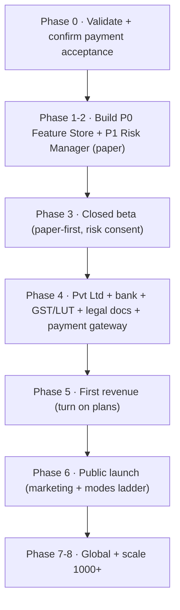

# 📚 DS2Aura Trading AI — Master Documentation Index & End-to-End Setup

**The single entry point.** This ties every plan — technical, product, and business/legal — into one ordered path from *solo developer* to *global SaaS company*.

> ⚠️ **NOT legal / tax / financial advice.** The business/legal/tax docs are a researched checklist to validate with a **CA + Company Secretary + FinTech lawyer**. Crypto + FinTech is heavily regulated and changes fast. Verify everything before acting.

---

## 0. Canonical decisions (the non-negotiables)

These are the locked, project-wide rules every doc assumes. **Don't contradict them.**

| Decision | Rule |
|---|---|
| **Funds** | **Non-custodial** — users trade their *own* accounts with *their own* keys; the platform never holds/moves funds. |
| **Positioning** | **Software / automation, NOT investment advice.** No "advice/tips/signals-as-advice." |
| **Claims** | **Never** "guaranteed/no-loss/returns/profit." Heavy risk disclosure everywhere. |
| **Risk** | Capital preservation first; deterministic safety gates are the final authority; ML/LLM may only make it *more* selective. |
| **LLM** | An LLM **never** sizes or places a trade — text→features only. |
| **Rollout** | Every change: **paper → shadow → small-live**, behind a flag, default OFF. |
| **Company** | Incorporate **late** (Pvt Ltd, near first revenue) — validate first. |
| **Payments** | **Confirm a processor accepts crypto-trading SaaS BEFORE building billing.** |
| **Plan tiers** | **Free · Starter · Pro · Premium · Enterprise** (canonical = [FINAL §31](./FINAL_TRADING_AGENT_MASTER_PLAN.md#31-subscription-feature-matrix)). |
| **Modes** | One engine, five modes: **Advisor → Signal → Paper → Semi-auto → Full-auto** ([FINAL Part B](./FINAL_TRADING_AGENT_MASTER_PLAN.md#part-b--user-trading-modes-advisor--signal--paper--semi-auto--full-auto)). |

---

## 1. The document set

### 🤖 Core product / engine
| Doc | What it covers |
|---|---|
| [FINAL_TRADING_AGENT_MASTER_PLAN](./FINAL_TRADING_AGENT_MASTER_PLAN.md) | **The master blueprint** — engine, AI/ML/LLM, risk, infra, cost, roadmap **+ Part B (5 trading modes, engines, dashboards)** |
| [08-how-the-bot-works-today](./08-how-the-bot-works-today.md) | How the current engine works end-to-end |
| [07-ai-ml-llm-roadmap](./07-ai-ml-llm-roadmap.md) | ML conviction + cheap shared LLM + auto-train detail |

### 🧭 Product / UX / platform
| Doc | What it covers |
|---|---|
| [PRODUCT_ARCHITECTURE_MASTER_PLAN](./PRODUCT_ARCHITECTURE_MASTER_PLAN.md) | Whole-product: dashboard, profile, exchange/strategy/risk UI, analytics, mobile |
| [USER_JOURNEY_MASTER_PLAN](./USER_JOURNEY_MASTER_PLAN.md) | Visitor → auth → onboarding → retention |
| [ADMIN_PORTAL_MASTER_PLAN](./ADMIN_PORTAL_MASTER_PLAN.md) | Metrics, user mgmt, KYC, global kill-switch, oversight |
| [SAAS_PLATFORM_MASTER_PLAN](./SAAS_PLATFORM_MASTER_PLAN.md) | Plans, billing, notifications, analytics (technical) |
| [PRODUCTION_DEPLOYMENT_MASTER_PLAN](./PRODUCTION_DEPLOYMENT_MASTER_PLAN.md) | Environments, CI/CD, observability, security, scaling, incident response |

### 🏦 Founder / company / legal / finance
| Doc | What it covers |
|---|---|
| [FOUNDER_MASTER_PLAN](./FOUNDER_MASTER_PLAN.md) | **The Phase 0–8 roadmap** (validate → incorporate → revenue → global) |
| [COMPANY_FORMATION_GUIDE](./COMPANY_FORMATION_GUIDE.md) | India entity (→ Pvt Ltd) + registration + banking |
| [SAAS_MONETIZATION_MASTER_PLAN](./SAAS_MONETIZATION_MASTER_PLAN.md) | Plans, pricing, margins |
| [PAYMENT_GATEWAY_MASTER_PLAN](./PAYMENT_GATEWAY_MASTER_PLAN.md) | Razorpay / MoR / Stripe + crypto-acceptance risk |
| [LEGAL_AND_COMPLIANCE_MASTER_PLAN](./LEGAL_AND_COMPLIANCE_MASTER_PLAN.md) | Positioning, funds model, forbidden claims, legal docs |
| [TAX_AND_ACCOUNTING_MASTER_PLAN](./TAX_AND_ACCOUNTING_MASTER_PLAN.md) | GST, export of services, global VAT, bookkeeping |
| [GO_TO_MARKET_MASTER_PLAN](./GO_TO_MARKET_MASTER_PLAN.md) | Personal → beta → first paying → public launch |
| [GLOBAL_EXPANSION_MASTER_PLAN](./GLOBAL_EXPANSION_MASTER_PLAN.md) | India/US/UK/EU/UAE/Singapore readiness |
| [BUSINESS_OPERATIONS_MASTER_PLAN](./BUSINESS_OPERATIONS_MASTER_PLAN.md) | Support, compliance, monitoring, incidents |
| [FINANCIAL_PROJECTION_MASTER_PLAN](./FINANCIAL_PROJECTION_MASTER_PLAN.md) | Unit economics 10 → 1000 customers |

### 📁 Original reference (V1)
[00-feature-parity](./00-feature-parity.md) · [01-system-architecture](./01-system-architecture.md) · [02-database-schema](./02-database-schema.md) · [03-api-documentation](./03-api-documentation.md) · [04-security-checklist](./04-security-checklist.md) · [05-deployment-guide](./05-deployment-guide.md) · [06-production-roadmap](./06-production-roadmap.md) · [dynamic-profit-protection](./dynamic-profit-protection.md) · [USER-SETUP-GUIDE](./USER-SETUP-GUIDE.md) · [DEPLOY-FREE](./DEPLOY-FREE.md)

---

## 2. End-to-end setup — the build path

| Step | Do this | Primary docs |
|---|---|---|
| **0 · Validate** | confirm demand; **email payment processors** to confirm they accept crypto-trading SaaS | [Founder](./FOUNDER_MASTER_PLAN.md) · [Payments](./PAYMENT_GATEWAY_MASTER_PLAN.md) |
| **1 · Build (tech)** | P0 Feature Store + **P1 Risk Manager**; modes engine; paper as a true virtual account | [FINAL](./FINAL_TRADING_AGENT_MASTER_PLAN.md) · [07](./07-ai-ml-llm-roadmap.md) |
| **2 · Productize** | profile hub, risk UI, exchange/strategy UI, analytics, onboarding | [Product](./PRODUCT_ARCHITECTURE_MASTER_PLAN.md) · [Journey](./USER_JOURNEY_MASTER_PLAN.md) |
| **3 · Beta** | invite-only, paper-first, collect testimonials, draft legal docs | [GTM](./GO_TO_MARKET_MASTER_PLAN.md) · [Legal](./LEGAL_AND_COMPLIANCE_MASTER_PLAN.md) |
| **4 · Company** | Pvt Ltd, bank, GST + LUT, DPIIT, payment gateway, publish legal docs | [Company](./COMPANY_FORMATION_GUIDE.md) · [Tax](./TAX_AND_ACCOUNTING_MASTER_PLAN.md) · [Legal](./LEGAL_AND_COMPLIANCE_MASTER_PLAN.md) |
| **5 · Revenue** | turn on plans (Free→Premium), billing webhooks, dunning, refunds | [Monetization](./SAAS_MONETIZATION_MASTER_PLAN.md) · [SaaS](./SAAS_PLATFORM_MASTER_PLAN.md) |
| **6 · Launch** | marketing site, ProductHunt/community, referral, support + kill-switch | [GTM](./GO_TO_MARKET_MASTER_PLAN.md) · [Ops](./BUSINESS_OPERATIONS_MASTER_PLAN.md) · [Admin](./ADMIN_PORTAL_MASTER_PLAN.md) |
| **7-8 · Global / scale** | multi-region, MoR tax, VPS + sharded workers, monitoring | [Global](./GLOBAL_EXPANSION_MASTER_PLAN.md) · [Deploy](./PRODUCTION_DEPLOYMENT_MASTER_PLAN.md) · [Finance](./FINANCIAL_PROJECTION_MASTER_PLAN.md) |

---

## 3. Status & validation

- ✅ **All cross-document links validated** (every `./*.md` reference resolves).
- ✅ **Plan tiers reconciled** to the canonical 5-tier model (Free/Starter/Pro/Premium/Enterprise).
- 📌 **Doc state = design/plan.** No production code has been changed by these docs.
- 🔀 **V1** (live product repo) and **V2** (this evolution repo) carry the same master-plan set; V2 also has `V2-STATUS.md` (build tracker).

> **Next build step:** P0 Feature Store + P1 Risk Manager + the `tradingMode` enum & virtual paper account — see [`FINAL_TRADING_AGENT_MASTER_PLAN.md`](./FINAL_TRADING_AGENT_MASTER_PLAN.md) §13–14 and Part B.
