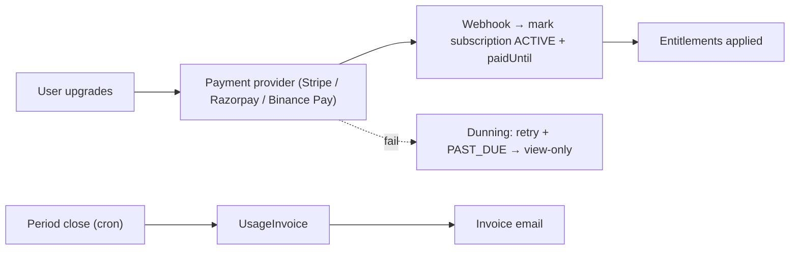
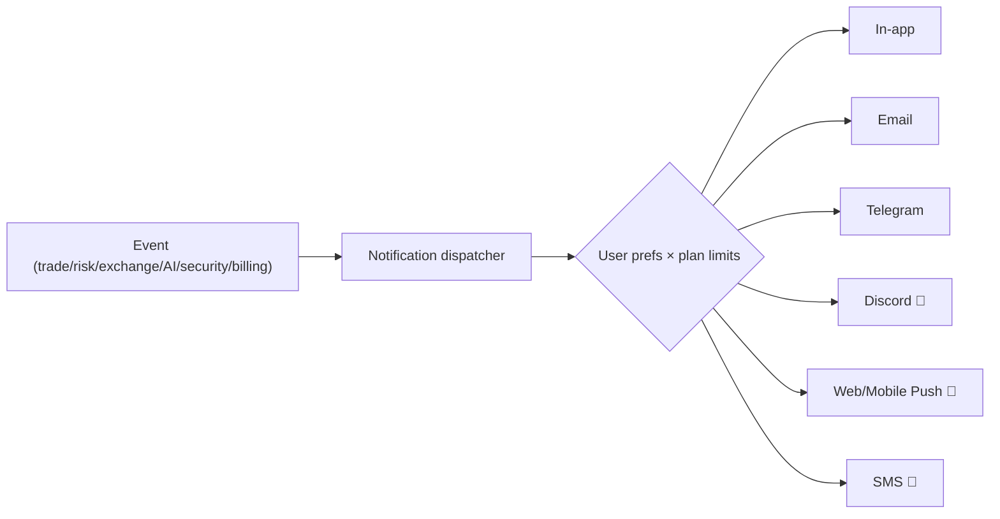

# 💼 SAAS PLATFORM — MASTER PLAN

**Monetization, plans, notifications, analytics, and billing for a commercial crypto-trading SaaS.**

> **Doc set:** [Trading agent](./FINAL_TRADING_AGENT_MASTER_PLAN.md) · [Product](./PRODUCT_ARCHITECTURE_MASTER_PLAN.md) · [User journey](./USER_JOURNEY_MASTER_PLAN.md) · [Admin](./ADMIN_PORTAL_MASTER_PLAN.md) · **SaaS (this)** · [Deploy](./PRODUCTION_DEPLOYMENT_MASTER_PLAN.md).
> **Legend:** ✅ Have · ⚠️ Partial · ❌ Missing · 🎯 Target.

---

## 1. Current monetization (grounded)

- Plans: **TRIAL** (30-day) → **BASIC** ($10/mo) / **PRO** ($100/yr). Per-trade overage was **removed** → trades effectively **unlimited**; only the subscription base is billed. ADMINs = free/unlimited.
- Gating: `canTradeNow()` → **view-only** when trial/sub lapses (bot + signals off, dashboard stays).
- Billing: monthly period close → `UsageInvoice`; coupons (one-time next-invoice discount); payment provider **stubbed** (`provider*` fields ready for Stripe/Razorpay/Binance Pay).
- One-account-one-trial enforcement via `TrialClaim` (email/mobile/exchange-UID fingerprint).

**Verdict:** billing **engine** is solid (periods, invoices, coupons, gating). What's missing is a **tiered plan design** with real **limits** (AI/exchange/strategy) and a **live payment provider**.

---

## 2. Plan design 🎯 (Free / Starter / Pro / Premium / Enterprise)

> 📌 **Canonical tiers = Free · Starter · Pro · Premium · Enterprise** — the authoritative feature/mode gate is the matrix in [`FINAL_TRADING_AGENT_MASTER_PLAN.md` §31](./FINAL_TRADING_AGENT_MASTER_PLAN.md#31-subscription-feature-matrix). **Premium** is the **full-automation** tier; **Enterprise** adds teams/white-label. The 4-tier list in older revisions is superseded by this 5-tier model.

> Value-metric = **capital protected + exchanges + strategies + AI**, *not* trade count (we never charge for more trades — that would incentivize overtrading, against the core principle).

| | 🆓 **Free** | 🚀 **Starter** | 💎 **Pro** | 🏢 **Enterprise** |
|---|---|---|---|---|
| Price | $0 | ~$15/mo | ~$39/mo (or $390/yr) | custom |
| **Trading** | **Paper only** | Live, 1 exchange | Live, all exchanges | Live + dedicated |
| Exchanges | 1 (paper) | 1 | **5** (Binance/Bybit/OKX/Bitget/CoinEx) | 5 + priority |
| Concurrent positions | 1 | 3 | 10 | custom |
| Strategies | 1 (default) | 3 | full catalog + clone | custom + private |
| **Risk engine** | basic | full | full + custom limits | full + bespoke |
| **AI** (ML conviction) | ❌ | ✅ gate | ✅ gate + ranking | ✅ + priority retrain |
| **LLM sentiment** | ❌ | shared | shared | shared + custom feeds |
| Backtesting | ❌ | limited | full walk-forward | full + bulk |
| Notifications | in-app | + Telegram/email | + Discord/push | + SMS + webhooks |
| Analytics | basic | standard | advanced (Sharpe/DD/export) | + API/raw export |
| Support | community | email | priority | SLA + dedicated |
| API access | ❌ | ❌ | ✅ personal tokens | ✅ + higher limits |

**Why a Free (paper-only) tier:** it's the **best onboarding & trust builder** — users watch the bot work risk-free, then upgrade to go live. Costs ~$0 (paper uses shared data) and is the top-of-funnel.

### 2.1 Limit enforcement

| Limit | Where enforced |
|---|---|
| Exchanges / concurrent positions / strategies | `BotConfig` + plan check in engine & API |
| AI on/off, sentiment | feature flag per plan in the signal step |
| Backtest quota | API rate per plan |
| Notification channels | preference center gated by plan |
| API tokens | issued only for Pro+ |

> Store plan **entitlements** in a `PlanFeature` map (or `SystemSetting`) so limits are config-driven, not hard-coded — admin-tunable without redeploy.

---

## 3. Billing & payments 🎯

| Item | Status | Target |
|---|---|---|
| Periods + invoices + gating | ✅ | keep |
| Coupons | ✅ | keep |
| **Live payment provider** | ❌ (stubbed) | **Stripe** (cards/global) + **Razorpay** (India) or **Binance Pay** (crypto) |
| Webhooks | ❌ | provider → activate/expire subscription |
| Dunning (failed payment) | ❌ | retry schedule → `PAST_DUE` → view-only |
| Proration / upgrade-downgrade | ❌ | handle mid-cycle plan change |
| Tax / invoices PDF | ⚠️ | invoice rows exist → render PDF + tax fields |

---

## 4. Notification system (channel architecture) 🎯

Today: in-app ✅, email (nodemailer) ✅, Telegram (per-user bot, AES-encrypted token) ✅.

| Channel | Status | Notes |
|---|---|---|
| In-app | ✅ | `Notification` table + realtime |
| Email | ✅ | nodemailer/SMTP |
| Telegram | ✅ | per-user bot token (encrypted) |
| **Discord** | ❌ | webhook per user (cheap, popular w/ crypto) |
| **Web/Mobile push** | ❌ | free; pairs with PWA ([product doc](./PRODUCT_ARCHITECTURE_MASTER_PLAN.md)) |
| **SMS** | ❌ | paid (Twilio) — **Pro/Enterprise only**, security/critical alerts |

**Events:** trade open/close, SL/TP hit, **risk alert**, **exchange alert**, **AI/agent alert**, security (new device), billing (trial-ending/invoice/payment-fail). A **preference center** (channel × event, gated by plan) is required.

---

## 5. Analytics platform (data layer) 🎯

UI lenses are in the [Product doc](./PRODUCT_ARCHITECTURE_MASTER_PLAN.md); here is the **data/aggregation** plan.

| Analytics | Source tables | Aggregation |
|---|---|---|
| Performance | `TradeHistory`, `PnlHistory` | daily rollups → Sharpe/Sortino/PF/expectancy |
| Risk | equity HWM, `RiskEvent` (new) | drawdown series, breaker counts |
| Portfolio | `Position` | allocation, correlation matrix |
| Strategy | `TradeHistory` + strategy tag | per-strategy P&L/win-rate |
| Trade | `TradeHistory` | R-multiple dist, MAE/MFE, hold-time |
| Exchange | fills + `ApiKey`/health | fees, latency, downtime per exchange |
| **Platform** (admin) | all users (aggregate) | MRR, cohort retention, usage ([admin doc](./ADMIN_PORTAL_MASTER_PLAN.md)) |

> Pre-compute daily rollups (`PnlHistory` already exists) so charts are cheap; keep raw rows pruned (90–180d) for cost.

---

## 6. Growth & retention (SaaS levers)

- **Free paper tier** = top-of-funnel + trust.
- **Referral / affiliate** (coupon engine already supports codes) 🎯.
- **Win-back**: trial-ending + idle-bot nudges via email/Telegram.
- **Transparency = retention**: honest "why gated" + risk gauges keep users from rage-quitting on quiet days.
- **Annual discount** (PRO already $100/yr ≈ 2 months free) — keep.

---

## 7. Priority actions (SaaS)

1. 🥇 **Live payment provider** (Stripe + webhooks + dunning) — without it, you can't actually charge.
2. 🥈 **Tiered plans + config-driven entitlements** (Free-paper / Starter / Pro / Enterprise).
3. 🥉 **Notification preference center** + Discord + web-push.
4. **Analytics rollups** (Sharpe/DD/returns) feeding the dashboard/analytics pages.
5. **Referral program** + win-back automations.

> **Principle:** monetize **capability and protection** (exchanges, strategies, AI, risk), **never trade frequency**. A generous **paper Free tier** converts skeptics; Pro unlocks multi-exchange + AI + analytics.
