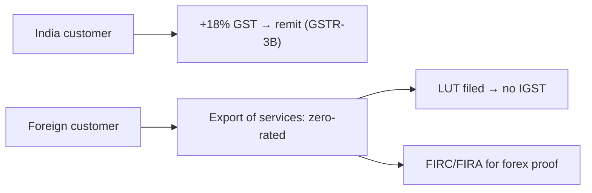

# 🧾 TAX & ACCOUNTING — MASTER PLAN

**GST, export of services, global VAT/sales-tax, forex, and bookkeeping for the SaaS.**

> ⚠️ **NOT tax advice.** Tax rules (rates, thresholds, crypto/VDA treatment) change and are jurisdiction-specific. **A Chartered Accountant (CA) is mandatory** once you incorporate. Verify everything below with them.
>
> See also: [Company formation](./COMPANY_FORMATION_GUIDE.md) · [Payments](./PAYMENT_GATEWAY_MASTER_PLAN.md) · [Global](./GLOBAL_EXPANSION_MASTER_PLAN.md).

---

## Executive Summary

- **You sell SaaS subscriptions = ordinary service revenue.** Because you're **non-custodial** (you never hold or trade crypto for users), the scary **VDA crypto tax (30% + 1% TDS) is the USER's problem on their own trades — NOT yours.** (Yet another reason to stay non-custodial.)
- **India customers:** charge **18% GST** on subscriptions (software service, SAC 9983/998314).
- **International customers:** treat as **export of services → zero-rated** under GST; file a **LUT** to invoice without IGST. Get **FIRC/FIRA** for forex receipts.
- **Global VAT/sales-tax:** if you bill customers directly (Razorpay/Stripe), *you* may become liable in EU/UK/US as you grow → this is exactly why a **Merchant-of-Record (Paddle/Lemon Squeezy) is attractive** (they handle it) — *if* they accept you.
- **Hire a CA early; automate invoices; keep clean books from day one.**

---

## 1. India customers — GST

| Item | Detail |
|---|---|
| Rate | **18%** on the subscription |
| SAC code | 9983 / 998314 (IT software services) |
| Registration | mandatory if turnover > ₹20L (services); **voluntary earlier** is common (ITC, B2B credibility, gateway needs) |
| Invoice | GST-compliant invoice per sale (gateway or tool can generate) |
| Returns | GSTR-1 + GSTR-3B (monthly/quarterly), annual GSTR-9 | 
| Input Tax Credit | claim GST paid on infra/tools/services |

## 2. International customers — export of services

| Item | Detail |
|---|---|
| Treatment | **zero-rated export** if: supplier in India, recipient outside India, place-of-supply outside India, payment in **convertible forex**, parties not mere establishments of each other |
| **LUT** | file a Letter of Undertaking → export **without paying IGST** (else pay IGST and claim refund — LUT is simpler) |
| Forex proof | **FIRC/FIRA** (Foreign Inward Remittance) from your bank/gateway — needed for export benefit + FEMA |
| FEMA | inward remittance compliance; repatriation rules |

## 3. Global VAT / sales tax

| Region | Tax | Who handles |
|---|---|---|
| EU | VAT (OSS/IOSS) — due on B2C digital services from €0 threshold (no small-seller exemption cross-border) | **MoR**, or you register OSS as you grow |
| UK | VAT (20%) on digital services | MoR or UK VAT registration |
| US | **sales tax by state economic nexus** (thresholds vary) | MoR, or register per-state at scale |
| Others | varies (GST in AU/CA/SG etc.) | MoR or local registration |

> 🔑 **This complexity is the #1 reason solo global SaaS founders use a Merchant of Record (Paddle/Lemon Squeezy)** — they become the seller and handle all of it. **Catch:** they may not accept crypto-trading software ([Payments doc](./PAYMENT_GATEWAY_MASTER_PLAN.md)). If you self-bill, you (or your CA) must monitor and register as you cross thresholds.

## 4. Income tax (the company)

| Entity | Rate (indicative) |
|---|---|
| Pvt Ltd (115BAA new regime) | ~22% + surcharge/cess |
| LLP / firm | 30% |
| Proprietor | individual slab |
| **DPIIT Startup (80-IAC)** | **3-year tax holiday** for eligible Pvt Ltd (claim it) |

Plus: **TDS** (deduct on certain vendor payments + salaries), advance tax, annual ITR.

## 5. Accounting requirements

- Bookkeeping (Zoho Books / TallyPrime / a CA-managed setup).
- **GST returns** (monthly/quarterly), **TDS returns**, **annual ITR**, **ROC filings** (AOC-4, MGT-7) — Pvt Ltd has a **statutory audit** requirement.
- Reconcile gateway payouts ↔ invoices ↔ bank; keep FIRC/FIRA for exports.
- Separate the founder's personal vs company money strictly (especially as a proprietor — don't commingle).

## Cost Estimates

| Item | Cost |
|---|---|
| CA retainer (early) | ₹25–40k/yr |
| Statutory audit (Pvt Ltd) | ₹15–30k/yr |
| Accounting software | ₹0–12k/yr |
| GST/registration | ₹0 (govt) + CA time |

## Risks

- Missing GST export conditions → losing zero-rating (pay 18% unnecessarily).
- Ignoring EU/UK/US tax at scale → back-taxes + penalties (MoR avoids this).
- Treating it like a crypto-trading business → wrong VDA exposure; you're a **software vendor** (clarify with CA).
- Commingling funds / no FIRC → FEMA + export-benefit problems.

## Alternatives

- **MoR (Paddle/Lemon Squeezy)** to outsource global tax entirely (if approved).
- Stay India-only initially to keep tax simple, expand later.

## Step-by-Step Actions

1. Incorporate → GST registration → **file LUT** (for exports).
2. Engage a **CA**; set up Zoho Books/Tally.
3. Auto-generate GST-compliant invoices via the gateway.
4. Keep **FIRC/FIRA** for every foreign receipt.
5. Claim **DPIIT 80-IAC** tax holiday.
6. Decide global tax: **MoR** (preferred) vs self-managed registrations.

## Timeline

Set up at incorporation (**Phase 4**); returns ongoing monthly/quarterly.

## Priority Checklist

- [ ] CA retained at incorporation.
- [ ] GST + **LUT** (export of services).
- [ ] 18% GST on India sales; zero-rate exports correctly.
- [ ] FIRC/FIRA on all forex receipts.
- [ ] DPIIT 80-IAC tax holiday claimed.
- [ ] Global VAT/sales-tax handled via MoR or registrations.
- [ ] Clean books; statutory audit scheduled.
