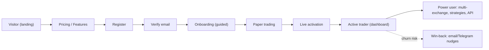
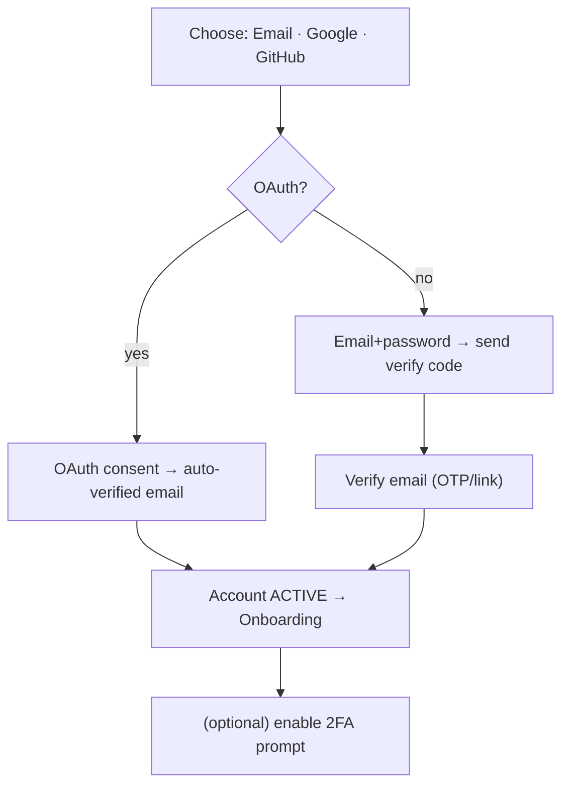
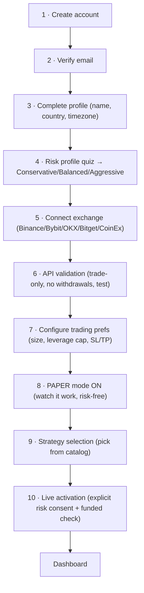
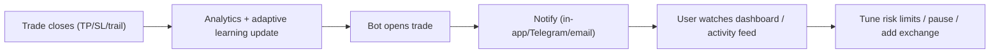

# 🧑‍🚀 USER JOURNEY — MASTER PLAN

**End-to-end journey: visitor → sign-up → onboarding → active trader → power user.**

> **Doc set:** [Trading agent](./FINAL_TRADING_AGENT_MASTER_PLAN.md) · [Product](./PRODUCT_ARCHITECTURE_MASTER_PLAN.md) · **User journey (this)** · [Admin](./ADMIN_PORTAL_MASTER_PLAN.md) · [SaaS](./SAAS_PLATFORM_MASTER_PLAN.md) · [Deploy](./PRODUCTION_DEPLOYMENT_MASTER_PLAN.md).
> **Legend:** ✅ Have · ⚠️ Partial · ❌ Missing · 🎯 Target.

---

## 1. Full journey map

---

## 2. Visitor journey (marketing) 🎯

Today: a single branded landing page. Target: a small marketing site (static, cheap, SEO).

| Page | Goal | Status |
|---|---|---|
| **Landing** | hook + value prop + CTA (Start free) | ⚠️ minimal |
| **Pricing** | plans, limits, FAQ-on-price, CTA | ❌ |
| **Features** | bot, risk-first, multi-exchange, paper, analytics | ❌ |
| **Documentation** | setup guide, API-key how-to, security | ⚠️ in-app only |
| **FAQ** | safety, fees, "does it guarantee profit?" (honest) | ❌ |
| **Contact / Support** | form → `SupportTicket`, email, Telegram | ⚠️ tickets exist, no page |
| **Trust** | security page (encryption, no-withdrawal keys), status page | ❌ |

> FinTech trust matters: prominently state **"trade-only keys, withdrawals never requested," "your funds stay on your exchange,"** and an **honest no-guarantee** disclaimer. This converts skeptical crypto users.

---

## 3. Registration & authentication

### 3.1 Current vs target

| Method | Status | Note |
|---|---|---|
| Email + password | ✅ | argon2, zod-validated |
| **Google login** | ❌ | schema has `supabaseUserId` → wire Supabase/Google OAuth |
| **GitHub login** | ❌ | OAuth (dev-friendly audience) |
| **OTP login** (email/SMS) | ⚠️ | email-OTP exists for *verification*, not as a login method |
| **MFA** | ⚠️ | TOTP 2FA ✅; add **backup codes** + optional SMS |
| Sign in | ✅ | with optional TOTP |
| **Password reset** | ❌ | only logged-in change-password exists — **add forgot-password flow** |
| Email verification | ⚠️ | token at register + email-OTP; unify into one clear gate |
| Session management | ✅ | refresh-token rotation, `Session` table |
| **Device management** | ❌ | sessions stored but no UI to list/revoke devices |
| Security controls | ⚠️ | rate-limit ✅, audit log ✅; add login-alert emails, suspicious-login checks |

### 3.2 Sign-up flow 🎯

### 3.3 Password reset 🎯 (missing — build)
`Forgot password → email a single-use, short-TTL reset token (hashed, like sessions) → set new password → revoke all sessions → login`. Rate-limited; audit-logged.

### 3.4 Device & session management 🎯
Profile → Security → **Active sessions**: list `Session` rows (device, IP, last-used), **revoke** one or **revoke-all-others**; email alert on new-device login.

---

## 4. Onboarding flow (redesign)

**Today:** 4 steps (account at register → connect Binance → pick mode → activate) — too fast for a real-money product; pushes users to live before they understand risk.

**Target:** a **10-step guided, paper-first** flow that builds confidence and reduces support load.

### 4.1 Step design notes

| Step | UX intent | Status |
|---|---|---|
| 1 Create | minimal friction (email or OAuth) | ✅ |
| 2 Verify | one clear gate (OTP or link) | ⚠️ unify |
| 3 Profile | name/country/timezone (drives daily-reset TZ) | ⚠️ |
| 4 **Risk profile** | short quiz → preset + **suggested risk limits** (capital-preservation framing) | ❌ |
| 5 Connect exchange | multi-exchange picker | ⚠️ Binance only |
| 6 API validation | live "✅ connected, withdrawals OFF, balance read OK" | ✅ Binance |
| 7 Trading prefs | size as **% of equity** (not raw $), leverage cap | ⚠️ |
| 8 **Paper-first** | default ON; "let's watch 10 trades before risking funds" | ✅ paper exists, ❌ not enforced |
| 9 Strategy pick | from the catalog ([product doc](./PRODUCT_ARCHITECTURE_MASTER_PLAN.md)) | ❌ |
| 10 Live activation | explicit consent modal + risk-limit confirmation | ⚠️ |

> 🎯 **Biggest UX win:** make **paper mode the default landing state** and require the user to *graduate* to live after seeing real (simulated) results. This matches "capital preservation first" and slashes early blow-ups.

---

## 5. Active-trader loop

Touchpoints that retain users: **clear notifications**, an **honest activity feed** (why a trade was gated), and **risk gauges** that build trust the bot is protecting them.

---

## 6. Notification touchpoints (user view)

Channels today: in-app ✅, email ✅, Telegram ✅ (per-user bot). Target adds Discord, web-push, SMS (channel architecture + plan limits → [SaaS doc](./SAAS_PLATFORM_MASTER_PLAN.md)).

| Event | Default channels | Status |
|---|---|---|
| Trade opened / closed | in-app + Telegram | ✅ |
| Stop-loss / take-profit hit | in-app + Telegram | ✅ |
| **Risk alert** (limit/drawdown breach) | all enabled | 🎯 add |
| **Exchange alert** (key invalid, ban, downtime) | email + in-app | 🎯 add |
| **AI/agent alert** (regime flip, paused) | in-app | ⚠️ |
| Security (new device, password change) | email | 🎯 add |
| Billing (trial ending, invoice, payment fail) | email + in-app | ⚠️ |

> A **preference center** (per-channel × per-event toggles) is required — see [Product §Profile](./PRODUCT_ARCHITECTURE_MASTER_PLAN.md).

---

## 7. Priority actions (journey)

1. 🥇 **Password reset** + **email-verify unification** + **device/session management** (security table-stakes).
2. 🥈 **10-step paper-first onboarding** with a **risk-profile quiz**.
3. 🥉 **Google/GitHub OAuth** (conversion) + **2FA backup codes**.
4. **Marketing pages** (pricing/features/FAQ/contact) to drive sign-ups.
5. **Notification preference center** + risk/exchange/security alerts.

> **Principle:** every step either builds **trust** (security, transparency, paper-first) or removes **friction** (OAuth, clear gates). For a real-money product, trust > speed.
